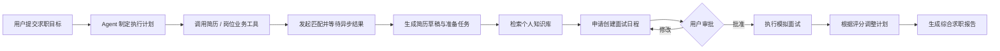
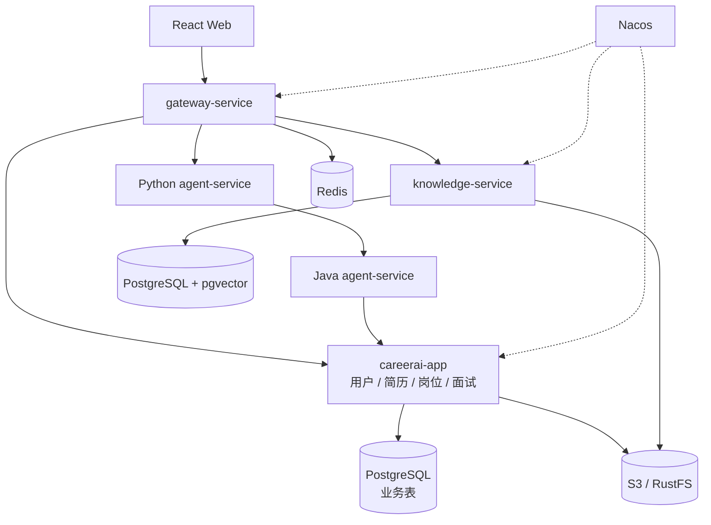
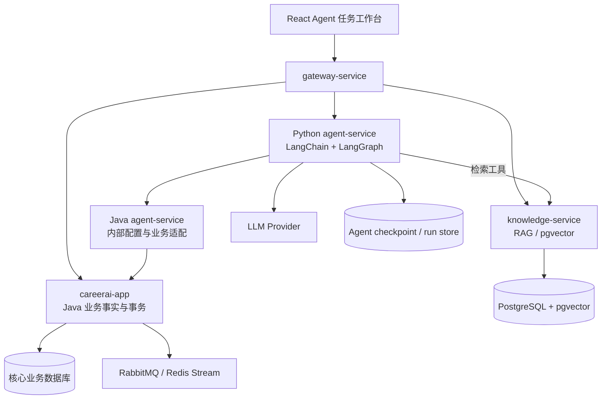

# CareerAI

面向大学生实习与校招场景的智能求职平台，目标是让 Agent 直接调用简历、岗位、匹配、知识库、面试和日程等业务能力，持续推进求职任务并交付可查询的业务结果。

CareerAI 基于 [InterviewGuide](https://github.com/Snailclimb/interview-guide) 进行二次开发，围绕“简历、目标岗位和面试表现”建立完整求职闭环。项目下一阶段将从功能型 AI 应用升级为业务执行型 Agent，而不是在现有页面旁边增加一个问答聊天框。

> 当前状态：Java 核心求职闭环已经进入可演示阶段。Python `agent-service` 已完成动态模型、首批 LangChain Tools，以及“选择简历 → 异步岗位匹配 → 恢复轮询 → 创建改进计划”LangGraph 流程；Java `backend/agent-service` 提供受保护的模型配置和业务 Tool。面试/知识库扩展、通用暂停取消、审批和 Agent 任务工作台仍待实现。

## 项目定位

CareerAI 面向个人求职者。用户提供的是目标和约束，Agent 需要调用真实业务能力完成任务，而不是只返回建议文本。



## 当前基线能力

- 简历上传、Tika 文本解析、内容去重和结构化 AI 诊断。
- 用户认证、岗位中心、JD 解析、简历-岗位匹配报告、简历改进计划和综合求职报告。
- 文字模拟面试、Skill 出题、智能追问、回答评分和报告导出。
- 基于 PostgreSQL + pgvector 的个人知识库和 RAG 问答。
- 基于 Redis Stream 的简历分析、知识库向量化和面试评估异步任务。
- 基于 RabbitMQ 的简历-岗位匹配异步任务链路，支持任务状态追踪、手动 ACK、失败重试和死信队列。
- Spring AI 多 Provider、结构化输出重试和 Prompt 模板。
- 基于 SSE 的 AI 回答和任务进度流式返回。
- Python `agent-service` 可运行骨架，使用 `uv` 管理依赖并生成锁文件。

当前采用“模块化单体 + 独立知识服务”：核心求职流程保留在 `careerai-app`，知识库/RAG 由 `knowledge-service` 独立承载，统一通过 `gateway-service` 暴露。用户、简历、岗位、匹配、面试和日程继续保留在核心应用内，不为了微服务数量继续拆分。

## Agent 化目标

首版 Agent 聚焦“求职作战任务”：用户输入一个 JD、截止时间和期望结果，Agent 自动读取候选简历、发起匹配、比较证据、生成准备计划、检索薄弱知识点，并在用户批准后创建面试日程。面试结束后，Agent 根据真实评分更新计划并生成综合报告。

Agent 化必须具备以下特征：

- 连续调用三个以上业务域的结构化工具；
- 至少产生一个可通过普通 API 查询的业务状态变化；
- 支持岗位匹配等异步任务的等待和恢复；
- 修改日程、正式简历和关键岗位状态前等待用户审批；
- 服务重启后可以通过 checkpoint 恢复；
- 重试不会重复创建岗位、匹配报告、计划或日程；
- 最终完成状态由业务查询验证，不由模型自行宣告。

以下内容不算项目定义的 Agent 化：

- 把 RAG 问答页面改名为 Agent；
- 仅使用 Function Calling 查询数据后生成一段回答；
- 多个模型互相讨论，但没有调用业务写能力；
- 让模型直接生成 SQL 或绕过 Java Service 修改数据库。

## 与上游项目的差异

| 方向 | 上游现状 | CareerAI 改造目标 |
| --- | --- | --- |
| 产品主线 | 简历分析、模拟面试、知识库等功能集合 | 目标 → Agent 规划 → 业务工具执行 → 审批 → 结果验证 |
| 用户体系 | 缺少完整认证，部分数据没有用户隔离 | JWT 登录、令牌刷新、全资源归属和越权测试 |
| 岗位能力 | 没有独立岗位与匹配模型 | 岗位中心、JD 解析、证据化匹配报告 |
| 应用架构 | Spring Boot 单体 | Java 模块化单体 + 独立知识服务 + Python Agent 服务 |
| 异步任务 | Redis Stream | RabbitMQ Confirm、ACK、重试、死信、幂等和补偿 |
| 数据存储 | PostgreSQL + pgvector | 按服务明确表所有权，负载或运维需要时再独立 PostgreSQL 实例 |
| 面试上下文 | 以通用 Skill 和简历为主 | 由用户、简历、目标岗位和知识库共同驱动 |
| Agent 能力 | 无跨模块任务编排 | 调用真实业务能力、等待异步任务、审批写操作并验证结果 |

## 目标技术栈

### Java 业务后端

- Java 21、Spring Boot、Spring Cloud Alibaba
- Spring AI、Nacos、Spring Cloud Gateway、OpenFeign
- RabbitMQ、Redis、PostgreSQL + pgvector
- Apache Tika、S3 兼容对象存储、SSE
- Maven、JUnit 5、Testcontainers

### Python Agent 服务

- Python、FastAPI、Pydantic
- LangChain Tools、Middleware
- LangGraph StateGraph、Checkpoint、Interrupt
- HTTP/OpenAPI 业务工具适配
- Agent Run、Step、Approval 和执行审计

### 前端

- React、TypeScript、Vite、Tailwind CSS
- React Router、Axios、Recharts

### 工程化

- 本地 Docker 中间件、GitHub Actions
- OpenAPI、Micrometer、结构化日志与 Trace ID

> Python Agent 服务已经绑定首批业务 Tool，并通过假服务测试验证异步等待、恢复和幂等键；真实跨进程链路完成验收后，才会作为完整 Agent 成果写入项目简历。

## 当前架构



当前服务边界：

| 服务 | 职责 |
| --- | --- |
| `gateway-service` | 路由、CORS、JWT 初检、限流、Trace ID |
| `careerai-app` | 用户、简历、岗位、匹配、面试等尚需本地事务协作的核心流程 |
| `knowledge-service` | 文档、分块、向量化、检索和 RAG 会话 |
| Python `agent-service` | Agent Run、LangGraph checkpoint、动态模型和跨业务编排 |
| Java `backend/agent-service` | 无数据库的内部配置与业务能力适配 |

`careerai-shared` 是 Java 公共依赖，不是独立微服务。当前不再计划把用户、简历、岗位和面试机械拆成多个部署单元。

## Agent 目标架构



边界原则：

- Java 是用户、简历、岗位、匹配、面试和日程等业务事实的唯一写入方。
- Python 负责目标解析、计划、工具选择、异步等待、checkpoint 和审批流程，不直接访问业务表。
- 现有 Spring AI 继续负责已经成熟的 JD 解析、简历分析、岗位匹配和面试评分等领域能力。
- Python LangChain/LangGraph 负责编排这些领域能力，不在首版重写全部 Java AI 逻辑。
- Java `backend/agent-service` 是无数据库的内部适配层：转发模型运行时配置和受控业务 Tool；Provider 数据、用户鉴权和业务规则仍归 `careerai-app`。
- Python 不保存 Provider 配置。每个 Run 读取一次 Java 配置快照，并按 `providerId + configVersion` 复用或重建 LangChain 模型。
- Python `agent-service` 由 Gateway 固定路由；Java `backend/agent-service` 可注册 Nacos，但内部模型配置默认直连 `8082`。
- MCP 只作为后续可选协议适配层，首版使用结构化 REST/OpenAPI 工具。

## 改造原则

1. Agent 必须调用真实业务能力并产生业务产物，不能以聊天回复作为完成结果。
2. Java 负责权限、事务、幂等和业务规则；Python 只负责编排，不能绕过 Java 直接写库。
3. 高风险写操作必须展示影响范围，并支持批准、编辑或拒绝。
4. 长任务必须支持持久化 checkpoint、暂停恢复和有上限重试。
5. 每条 AI 结论尽量附带简历或 JD 原文证据，降低模型幻觉。
6. 保持模块化单体，不继续拆分没有独立负载、数据或发布需求的业务服务。
7. 关系数据和向量数据保持明确所有权，不做跨服务 Join 或共享 JPA Entity。
8. Redis 和 RabbitMQ 职责分离，不让两套消息机制处理同一种任务。
9. 简历中的技术描述必须有代码、自动化测试、业务结果或故障演练支撑。

## 路线图

- [x] 盘点上游功能、依赖、测试和架构差距。
- [x] 输出 CareerAI 目标业务闭环和改造工作清单。
- [x] 导入干净的上游代码并调整为 `frontend + backend` 目录。
- [x] 将后端从 Gradle 转换为 Java 21 Maven 聚合工程。
- [x] 修复并验证前端构建、后端编译和测试基线。
- [x] 将 Java 包名迁移为 `com.yzh666.careerai`。
- [x] 实现用户认证和全链路数据隔离。
- [x] 实现岗位中心、JD 解析和岗位匹配报告。
- [x] 将简历-岗位匹配迁移为 RabbitMQ 可靠异步链路。
- [x] 完成面向目标岗位的文字模拟面试。
- [x] 完成 RAG 来源引用、元数据过滤和聊天记录来源持久化。
- [x] 抽出第一阶段 `knowledge-service`，独立承载知识库、向量化和 RAG 会话。
- [x] 接入 Gateway 和 Nacos，完成基于服务发现的网关路由。
- [x] 接入 OpenFeign，打通主应用到知识库服务的服务间调用。
- [x] 从主应用移除知识库/RAG Controller 与向量持久化配置。
- [x] 确定不继续机械拆分核心业务服务，保持模块化单体边界。
- [x] 输出执行型 Agent 改造方案、业务工具清单和验收标准。
- [x] 创建 Python `agent-service`，接入 FastAPI、LangGraph 和可切换 checkpoint。
- [x] 新增 Java `backend/agent-service` 内部桥接模块，打通 Provider 配置与 Python 动态模型初始化。
- [x] 增加首批 Java 业务 Tool：简历读取、岗位读取、匹配任务/报告和简历改进计划。
- [x] 在 Python 注册首批 LangChain Tools，实现异步匹配等待/恢复和改进计划产物。
- [ ] 将简历、岗位、匹配、面试、日程和知识库能力封装为结构化 Agent Tools。
- [ ] 实现“岗位 → 选简历 → 匹配 → 准备计划 → 模拟面试 → 综合报告”首个 Agent 闭环。
- [ ] 实现异步任务等待、checkpoint 恢复、幂等调用和执行预算。
- [ ] 新增简历草稿版本和可执行准备任务业务模型。
- [ ] 实现日程、正式简历和关键岗位状态的人工审批。
- [ ] 将前端改造为 Agent 任务工作台，展示计划、步骤、审批和业务产物。
- [ ] 完成 Agent 固定场景评测、越权测试、重复写入测试和故障恢复演练。
- [ ] 完成端到端测试、可观测性、部署和项目演示材料。

当前业务基线的历史改造记录见 [CareerAI 改造工作清单](docs/CareerAI-改造工作清单.md)。后续 Agent 化以 [CareerAI Agent 化改造方案](docs/CareerAI-Agent化改造方案.md) 为主要实施文档，数据库与服务拆分遵循 [数据库边界与拆分路线](docs/database-boundaries.md)。

## 当前目录

```text
CareerAI/
├── frontend/                         # React + TypeScript + Vite
├── agent-service/                    # Python + FastAPI + LangGraph Agent 编排服务
│   ├── pyproject.toml                # uv 项目与依赖声明
│   ├── uv.lock                       # 锁定依赖版本
│   ├── src/careerai_agent/
│   └── tests/
├── backend/
│   ├── pom.xml                       # Maven 父工程
│   ├── careerai-shared/              # Java 应用共用的稳定技术基础设施
│   │   ├── pom.xml
│   │   └── src/
│   ├── gateway-service/              # API 网关，路由到主应用和知识服务
│   │   ├── pom.xml
│   │   └── src/
│   ├── knowledge-service/            # 知识库/RAG 服务
│   │   ├── pom.xml
│   │   └── src/
│   ├── agent-service/                # Java 内部配置/业务能力适配层（无业务数据库）
│   │   ├── pom.xml
│   │   └── src/
│   └── careerai-app/                 # 核心业务模块化单体与 Provider 唯一数据源
│       ├── pom.xml
│       └── src/
├── docs/
│   ├── CareerAI-改造工作清单.md
│   ├── CareerAI-Agent化改造方案.md
│   └── database-boundaries.md
├── .env.example
├── .sdkmanrc
├── AGENTS.md
├── LICENSE
├── NOTICE.md
└── README.md
```

当前数据所有权仍只拆出知识库边界。`knowledge-service` 不访问用户表，只校验主应用签发的 JWT 并保存 `userId`；Java Agent 桥接不拥有数据库。数据库演进方案见 [数据库边界说明](docs/database-boundaries.md)。

仓库根目录 `agent-service/` 是 Python 编排工程；`backend/agent-service/` 是 Java 内部桥接模块。浏览器只通过 Gateway 访问 Python 的 `/api/agent/**`，内部调用链为 `Python -> Java agent-service -> careerai-app`。业务 Tool 除校验 `X-Agent-Service-Token` 外，还必须透传用户 `Authorization`、`X-Agent-Run-Id` 和 `X-Agent-Step-Id`；写 Tool 额外要求 `Idempotency-Key`。

## 本地开发

项目不使用 Docker Compose，应用直接连接本机 Docker 中已经存在的中间件：

| 能力 | 本地容器 | 端口 | 当前阶段 |
| --- | --- | --- | --- |
| PostgreSQL + pgvector | `v-postgres` | `5432` | 必需 |
| Redis | `dev-redis7` | `6379` | 必需 |
| RustFS / S3 | `v-rustfs` | `9000/9001` | 必需 |
| RabbitMQ | `rabbitmq` | `5672/15672` | 开启 `APP_RABBITMQ_ENABLED=true` 后用于岗位匹配异步链路 |
| Nacos | `nacos` | `8848/9848/9849` | 服务注册与发现 |

本地 PostgreSQL 容器中需要独立的 `careerai` 数据库和 `vector` 扩展。复制配置模板并填写本机已有容器的真实凭证：

```bash
cp .env.example .env
sdk env
```

启动后端：

```bash
cd backend
mvn clean test
# 首次启动或 shared 契约变化后，刷新单模块运行所读取的本地依赖
mvn -pl careerai-shared install -DskipTests
mvn -pl careerai-app spring-boot:run
mvn -pl knowledge-service spring-boot:run
mvn -pl agent-service spring-boot:run
```

启动网关：

```bash
cd backend
mvn -pl gateway-service spring-boot:run
```

安装并启动 Python Agent 服务：

```bash
cd agent-service
uv sync
cp .env.example .env
uv run uvicorn careerai_agent.main:app --reload --port 8000
```

默认端口：主应用 `8080`，知识库服务 `8081`，Java Agent 内部桥接 `8082`，Python Agent `8000`，网关 `8090`。Java Agent 桥接不使用数据库；Provider 表仍只位于 `careerai-app`。

启动本地 Nacos：

```bash
docker run -d --name nacos \
  -e MODE=standalone \
  -p 8848:8848 -p 9848:9848 -p 9849:9849 \
  nacos/nacos-server:v2.4.3
```

服务注册默认读取：

```env
NACOS_DISCOVERY_ENABLED=true
NACOS_REGISTER_ENABLED=true
NACOS_SERVER_ADDR=localhost:8848
NACOS_NAMESPACE=
NACOS_GROUP=DEFAULT_GROUP
```

服务仍默认注册到 Nacos。为了避免本地单机开发时网关通过机器局域网 IP 复用失效连接，网关路由默认直连本地端口：

| 路径 | 转发目标 |
| --- | --- |
| `/api/knowledgebase/**` | `http://localhost:8081` |
| `/api/rag-chat/**` | `http://localhost:8081` |
| `/api/agent/**` | `http://localhost:8000` |
| 其它 `/api/**` | `http://localhost:8080`（`careerai-app`） |

如需验证 Nacos 负载均衡路由，可在启动 `gateway-service` 前设置：

```env
GATEWAY_APP_ROUTE_URI=lb://careerai-app
GATEWAY_KNOWLEDGE_ROUTE_URI=lb://knowledge-service
GATEWAY_AGENT_ROUTE_URI=http://localhost:8000
```

主应用通过 OpenFeign 调用知识库服务：

| 主应用接口 | 内部调用 |
| --- | --- |
| `/api/system/downstreams/knowledge-service/health` | `careerai-app -> OpenFeign -> knowledge-service /actuator/health` |

Agent 模型配置内部调用链：

| 调用方 | 内部调用 |
| --- | --- |
| Python `agent-service` | `GET http://localhost:8082/internal/agent/model-config` |
| Java `backend/agent-service` | OpenFeign 调用 `careerai-app /internal/agent/model-config` |

首批业务 Tool 统一挂在 Java `backend/agent-service` 的 `/internal/agent/tools` 下，包括：

- 简历列表/详情、岗位详情；
- 创建/查询岗位匹配任务、读取匹配报告；
- 创建/查询简历改进计划。

运行前必须让三个进程使用相同的 `AGENT_INTERNAL_SERVICE_TOKEN`。Provider 设置页可以单独选择“Agent 默认”，切换后下一个 Run 自动使用新模型，无需重启 Python。

已有数据库升级时执行 [Agent 默认 Provider 迁移脚本](docs/sql/20260716-add-agent-default-provider.sql) 和 [Agent Tool 幂等键迁移脚本](docs/sql/20260716-add-agent-tool-idempotency.sql)；本地 `ddl-auto=update` 会同步可空字段。

启动前端：

```bash
cd frontend
corepack enable
pnpm install --frozen-lockfile
pnpm dev
```

默认访问地址：前端 `http://localhost:5173`，Python Agent `http://localhost:8000`，Java Agent 内部桥接 `http://localhost:8082`，主应用 Swagger UI `http://localhost:8080/swagger-ui.html`，API 网关 `http://localhost:8090`。
前端开发代理默认走 API 网关 `http://localhost:8090`，需要同时启动 `gateway-service`、`careerai-app`、`knowledge-service` 和 Nacos。若临时只启动主应用调试，可设置 `VITE_API_PROXY_TARGET=http://localhost:8080` 直连 `careerai-app`（知识库接口除外）。

## Agent 化实施顺序

1. [x] 创建 Python `agent-service`，实现 Agent Run 创建/查询、checkpoint 和 Java 身份校验骨架。
2. [x] 增加 Java 内部桥接服务和 Agent 默认 Provider，支持 Python 动态初始化/切换模型。
3. [x] 增加首批 Java Tool 契约，打通简历、岗位、异步匹配和改进计划调用链。
4. [x] 在 Python 中注册首批 Tool，并实现异步任务等待和 LangGraph 状态流转。
5. [ ] 增加暂停、恢复、取消和 SSE 运行事件接口。
6. [ ] 接入面试、日程和知识库工具，验证用户隔离和工具契约。
7. [ ] 接入 JD 解析、岗位创建和综合报告，完成首个跨模块执行闭环。
8. [ ] 新增简历草稿版本和准备任务，把 AI 建议转成可查询、可完成的业务产物。
9. [ ] 接入日程和关键状态写工具，实现批准、编辑和拒绝三种人工决策。
10. [ ] 将前端升级为 Agent 任务工作台，展示计划、执行时间线、审批和最终产物。
11. [ ] 使用固定场景验证目标完成率、工具选择、重复写入、越权和故障恢复。

首版只实现一个“求职作战 Agent”，不引入多个子 Agent。ASR/TTS、HR 企业端、自动登录招聘网站投递和支付功能不进入当前范围。

## 上游与许可证

本项目基于 [Snailclimb/interview-guide](https://github.com/Snailclimb/interview-guide) 修改。上游项目使用 AGPL-3.0 License；本仓库保留原许可证、上游来源和修改说明，并按许可证要求公开对应源码。导入版本和迁移说明见 [NOTICE.md](NOTICE.md)。

项目完成前，请勿将尚未实现或未验证的目标能力作为已完成成果写入简历。
