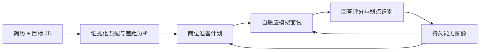
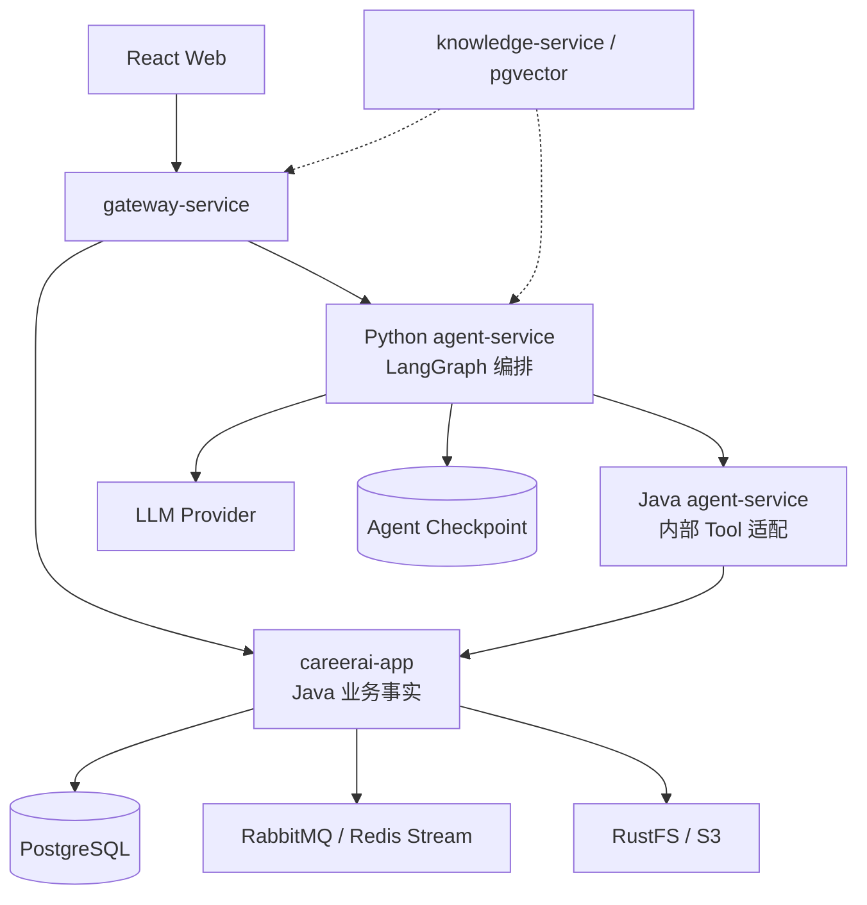

# CareerAI

CareerAI 是一个面向实习和校招场景的**岗位驱动自适应面试教练 Agent**。

项目只聚焦两个相互反馈的核心方向：

1. **简历–JD–规划**：基于简历证据和岗位要求生成可解释、可执行的准备计划。
2. **自适应模拟面试**：根据 JD 权重、当前回答和历史能力画像动态决定追问、换题、难度与后续训练方向。

项目的目标不是增加一个聊天框，而是展示 Agent 如何调用 Java 业务能力、等待异步任务、根据真实结果决策，并把结果持久化为普通业务数据。

> 当前状态：已完成 Java/Python Agent 调用骨架、动态模型配置、结构化业务 Tool、简历与岗位读取、RabbitMQ 异步岗位匹配、Checkpoint 恢复、简历改进计划和 Agent 工作台。下一阶段只围绕证据化规划、自适应面试和持久能力画像继续收敛。

## 项目定位



### 方向一：简历–JD–规划

Agent 不只生成一段简历建议，而是围绕真实业务数据完成：

- 解析 JD 的技能、项目、经验和隐性要求；
- 从一份或多份简历中提取对应证据；
- 区分“能力不足”和“简历缺少证据”；
- 基于技能、项目和关键词证据选择更合适的简历；
- 启动异步岗位匹配并等待结果；
- 根据差距、重要程度和截止时间生成准备计划；
- 使用后续面试表现修正计划。

目标输出不是聊天消息，而是可通过业务 API 查询的匹配报告、改进计划和岗位准备度报告。

### 方向二：自适应模拟面试

模拟面试中的 Agent 决策主要体现在：

- 从 JD 重点、简历项目和历史弱点中选择下一知识方向；
- 根据当前回答决定继续追问、切换方向或调整难度；
- 判断某项能力的证据是否充分，避免机械执行固定题单；
- 对历史薄弱项进行间隔复测，减少已经掌握内容的重复提问；
- 面试结束后更新能力画像，并重新调整岗位准备计划。

文字面试是当前主线。语音、ASR 和 TTS 不进入核心验收范围。

## 持久记忆

CareerAI 的持久记忆不是无限保存聊天记录，也不等同于 LangChain Chat Memory。

长期记忆以 Java 业务数据的形式保存，包括：

- 目标岗位方向和 JD 能力权重；
- 简历中的项目与技能证据；
- 历史面试问题、回答评分和暴露弱点；
- 各技能掌握程度、置信度和最近验证时间；
- 已完成和待完成的岗位准备任务；
- 同类问题的进步趋势。

每条能力结论都应保留 `evidenceType`、`evidenceId`、`confidence` 和 `observedAt`。Python Agent 只能通过受控 Tool 读取或更新记忆，不能直接访问 Java 业务数据库。

LangGraph Checkpoint 负责当前 Run 的执行恢复；能力画像负责跨 Run、跨面试的长期记忆，两者不能混用。

## Agent 与 Java 的职责边界

| 组件 | 负责 | 不负责 |
| --- | --- | --- |
| `careerai-app` | 用户、简历、岗位、匹配、面试、评分、能力画像、事务与业务规则 | 跨业务长流程编排 |
| Java `backend/agent-service` | 内部令牌、模型配置桥接、Agent Tool 白名单和业务适配 | 保存 Agent 状态或直接持有业务表 |
| Python `agent-service` | LangGraph 状态机、目标规划、工具选择、条件决策、等待和恢复 | 直接访问业务数据库 |
| React 前端 | 创建任务、展示执行轨迹、进行模拟面试、查看画像和报告 | 在浏览器中执行 Agent 业务逻辑 |

核心原则：**Java 是业务事实的唯一所有者，Python 是业务能力的编排者。**

当前不引入多个子 Agent，也不使用多个模型互相讨论来代替业务执行。规划和面试可以实现为同一个 Agent 下的两个 LangGraph 子图。

## 当前已实现

### Java 后端

- Java 21 Maven 聚合工程和模块化单体；
- JWT 登录与用户数据隔离；
- 简历上传、Tika 文本解析、结构化分析和对象存储；
- 目标岗位、JD 解析、岗位匹配报告和简历改进计划；
- 文字模拟面试、回答记录、评分和面试报告；
- RabbitMQ 岗位匹配任务，支持 ACK、重试、死信和任务状态查询；
- Spring AI 多 Provider 和结构化输出；
- Java Agent 内部桥接、Tool 白名单、上下文透传和写操作幂等。

### Python Agent

- FastAPI 服务和 JWT 用户校验；
- 从 Java 动态读取 Agent 默认模型配置；
- LangChain 结构化业务 Tools；
- LangGraph Run、Checkpoint 和恢复执行；
- `简历 → 岗位 → 异步匹配 → 匹配报告 → 改进计划` 首个业务闭环；
- Run/Step 上下文、稳定幂等键和结构化业务错误。

### React 前端

- 简历管理和岗位中心；
- 文字模拟面试和面试记录；
- Agent 任务执行台；
- Agent 步骤状态、异步恢复、匹配报告和改进计划展示；
- Provider 管理和 Agent 默认模型切换。

## 尚未完成

- 模型计划与实际图节点仍需统一，当前执行流程主要由固定状态图驱动；
- 多份简历尚未根据岗位匹配证据进行并行比较；
- 面试 Tool 尚未接入 Python Agent 决策图；
- 缺少跨面试持久能力画像和记忆更新策略；
- 缺少根据回答评分进行追问、换题和难度调整的决策节点；
- 缺少面试结果反向修正规划的完整闭环；
- 本地默认内存 Checkpoint，生产模式需要 PostgreSQL Checkpoint；
- Run 历史、取消、人工重试、SSE 事件和完整 ToolCall 审计仍待补充。

## 范围收束

### 核心保留

- 用户认证与资源隔离；
- 简历上传、分析和证据提取；
- JD、岗位和匹配；
- 岗位准备计划；
- 文字模拟面试与评分；
- 持久能力画像；
- Agent 工作台和岗位准备度报告；
- 动态模型配置。

### 可选扩展

- `knowledge-service` 和个人知识库检索；
- PostgreSQL + pgvector 的历史回答语义检索；
- Nacos 服务发现；
- 独立知识库/RAG 页面。

这些代码可以保留作为历史实现或后续 Tool，但不属于默认产品入口和核心演示依赖。

### 暂不继续

- 投递过程管理和自动投递；
- 复杂面试日历和外部日历同步；
- 邮件、招聘网站和第三方账号连接；
- ASR、TTS 和完整语音面试；
- Multi-Agent、MCP 和长期聊天机器人；
- HR 企业端、支付和运营系统；
- 为展示技术栈继续拆分用户、简历、岗位或面试微服务。

## 架构



默认演示保留模块化单体，不继续机械拆分微服务。`knowledge-service` 是可选扩展，不影响简历–JD–面试主链运行。

## 技术栈

### Java

- Java 21、Spring Boot、Spring AI
- Spring Cloud Gateway、OpenFeign
- PostgreSQL、Redis、RabbitMQ
- JPA、Apache Tika、S3 兼容对象存储
- Maven、JUnit 5

### Python Agent

- Python 3.12、uv、FastAPI、Pydantic
- LangChain Tools
- LangGraph StateGraph、Checkpoint、Runtime Context
- HTTP 业务工具适配

### 前端

- React 18、TypeScript、Vite、Tailwind CSS
- React Router、Axios、Framer Motion、Recharts

## 目录

```text
CareerAI/
├── frontend/                         # React 前端
├── agent-service/                    # Python Agent 编排
├── backend/
│   ├── careerai-shared/              # Java 公共契约与基础设施
│   ├── careerai-app/                 # 核心业务模块化单体
│   ├── agent-service/                # Java Agent 内部桥接
│   ├── gateway-service/              # API 网关
│   └── knowledge-service/            # 可选知识库/RAG 扩展
└── docs/                              # 架构、迁移和设计文档
```

仓库根目录的 `agent-service/` 是 Python 编排服务；`backend/agent-service/` 是 Java 内部桥接服务，两者职责不同。

## 本地启动

### 必需基础设施

| 能力 | 默认端口 | 用途 |
| --- | --- | --- |
| PostgreSQL | `5432` | 核心业务数据和可选 Agent Checkpoint |
| Redis | `6379` | 现有异步分析和缓存 |
| RabbitMQ | `5672/15672` | 岗位匹配异步任务 |
| RustFS / S3 | `9000/9001` | 简历文件存储 |

Nacos 和 `knowledge-service` 不属于默认演示依赖。使用本地固定路由时可设置：

```env
NACOS_DISCOVERY_ENABLED=false
NACOS_REGISTER_ENABLED=false
APP_RABBITMQ_ENABLED=true
```

复制本地配置并确保 Java 核心、Java Agent 桥接和 Python Agent 使用相同的 `AGENT_INTERNAL_SERVICE_TOKEN`：

```bash
cp .env.example .env
sdk env
```

### 启动 Java

```bash
cd backend
mvn clean test
mvn -pl careerai-app spring-boot:run
mvn -pl agent-service spring-boot:run
mvn -pl gateway-service spring-boot:run
```

### 启动 Python Agent

```bash
cd agent-service
uv sync
cp .env.example .env
uv run uvicorn careerai_agent.main:app --reload --port 8000
```

### 启动前端

```bash
cd frontend
corepack enable
pnpm install --frozen-lockfile
pnpm dev
```

默认地址：

| 服务 | 地址 |
| --- | --- |
| React | `http://localhost:5173` |
| Gateway | `http://localhost:8090` |
| Java 核心 | `http://localhost:8080` |
| Java Agent 桥接 | `http://localhost:8082` |
| Python Agent | `http://localhost:8000` |

Gateway 默认路由：

- `/api/agent/**` → Python Agent `8000`
- 其他 `/api/**` → Java 核心 `8080`
- 知识库接口仅在可选 `knowledge-service` 启动时使用

## 当前 Agent Tool

首批 Tool 通过 Java `backend/agent-service` 的 `/internal/agent/tools/**` 暴露：

- 查询简历列表和简历详情；
- 查询目标岗位；
- 创建和查询岗位匹配任务；
- 查询岗位匹配报告；
- 创建和查询简历改进计划。

Tool 调用必须携带用户 JWT、`X-Agent-Run-Id` 和 `X-Agent-Step-Id`；写 Tool 额外使用稳定 `Idempotency-Key`。

## 聚焦路线图

### 阶段 0：Agent 业务调用骨架

- [x] Java/Python Agent 服务边界；
- [x] 动态模型配置；
- [x] 结构化业务 Tools；
- [x] 异步岗位匹配、Checkpoint 和恢复；
- [x] 简历改进计划产物；
- [x] Agent 任务执行台。

### 阶段 1：证据化简历–JD–规划

- [ ] 将模型计划和实际执行步骤统一为结构化计划；
- [ ] 建立 JD 要求与简历证据矩阵；
- [ ] 多份简历并行匹配并根据证据选择；
- [ ] 区分能力缺失和表达缺失；
- [ ] 形成带优先级、截止时间和验证方式的岗位准备计划。

### 阶段 2：自适应模拟面试

- [ ] 将面试会话、问题生成、回答评分和报告封装为 Agent Tools；
- [ ] 根据 JD 权重和当前回答选择下一知识点；
- [ ] 支持追问、换题、难度调整和停止条件；
- [ ] 将面试 Session 与岗位准备 Agent Run 关联。

### 阶段 3：持久能力画像

- [ ] 建立带证据、置信度和时间的技能画像；
- [ ] 从面试评分中提取稳定弱点；
- [ ] 跨面试避免重复已掌握问题；
- [ ] 根据遗忘时间和历史表现安排复测；
- [ ] 支持用户查看和纠正能力画像。

### 阶段 4：闭环与评测

- [ ] 面试结束后自动修正岗位准备计划；
- [ ] 生成岗位准备度和进步趋势报告；
- [ ] 使用固定场景评测规划准确率、问题选择和弱点修复效果；
- [ ] 验证越权、重复写入、服务重启和故障恢复；
- [ ] 完成 Run、Step、ToolCall 和 Memory Update 审计。

## 验收标准

项目最终需要证明：

1. Agent 能从简历和 JD 中生成带原文证据的岗位准备计划；
2. Agent 能根据 JD、当前回答和历史画像自主决定追问、换题或调整难度；
3. 至少包含一个异步业务任务的等待和恢复；
4. 面试结果能够形成跨 Session 持久的能力画像；
5. 下一次面试会主动验证历史弱点，减少无意义重复；
6. 面试结果能够反向更新岗位准备计划；
7. 所有关键结论都能追溯到简历、JD 或历史回答。

## 验证命令

```bash
cd backend && mvn test
cd agent-service && uv run pytest && uv run ruff check src tests && uv run mypy src
cd frontend && pnpm build
```

## 上游与许可证

本项目基于 [Snailclimb/interview-guide](https://github.com/Snailclimb/interview-guide) 修改。上游项目使用 AGPL-3.0 License；本仓库保留原许可证、上游来源和修改说明，详见 [NOTICE.md](NOTICE.md)。

项目完成前，请勿将尚未实现或未验证的目标能力作为已完成成果写入简历。
