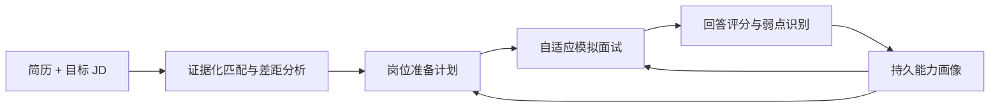
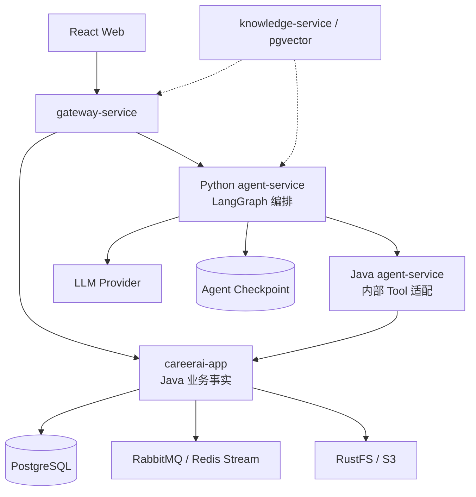

# CareerAI

CareerAI 是一个面向实习和校招场景的**岗位驱动自适应面试教练 Agent**。

项目只聚焦两个相互反馈的核心方向：

1. **简历–JD–规划**：基于简历证据和岗位要求生成可解释、可执行的准备计划。
2. **自适应模拟面试**：根据 JD 权重、当前回答和历史能力画像动态决定追问、换题、难度与后续训练方向。

项目的目标不是增加一个聊天框，而是展示 Agent 如何调用 Java 业务能力、等待异步任务、根据真实结果决策，并把结果持久化为普通业务数据。

> 当前状态：两条核心主线已经形成可运行闭环。岗位准备支持证据矩阵、异步等待恢复和结构化任务；模拟面试支持跨场次蓝图、自适应决策、持久画像、结束总结和下一场复测。默认演示与验收步骤见 `docs/PROJECT-CLOSEOUT.md`。

## 项目定位



### 方向一：简历–JD–规划

Agent 不只生成一段简历建议，而是围绕真实业务数据完成：

- 解析 JD 的技能、项目、经验和隐性要求；
- 从一份或多份简历中提取对应证据；
- 区分“能力不足”和“简历缺少证据”；
- 基于技能、项目和关键词证据选择更合适的简历；
- 启动异步岗位匹配并等待结果；
- 根据差距、重要程度和截止时间生成准备计划；
- 使用后续面试表现修正计划。

目标输出不是聊天消息，而是可通过业务 API 查询的匹配报告、改进计划和岗位准备度报告。

### 方向二：自适应模拟面试

模拟面试中的 Agent 决策主要体现在：

- 从 JD 重点、简历项目和历史弱点中选择下一知识方向；
- 根据当前回答决定继续追问、切换方向或调整难度；
- 判断某项能力的证据是否充分，避免机械执行固定题单；
- 对历史薄弱项进行跨场次复测，减少已经掌握内容的基础重复提问；
- 面试结束后更新能力画像，并重新调整岗位准备计划。

文字面试是当前主线。语音、ASR 和 TTS 不进入核心验收范围。

## 持久记忆

CareerAI 的持久记忆不是无限保存聊天记录，也不等同于 LangChain Chat Memory。

长期记忆以 Java 业务数据的形式保存，包括：

- 目标岗位方向和 JD 能力权重；
- 简历中的项目与技能证据；
- 历史面试问题、回答评分和暴露弱点；
- 各技能掌握程度、置信度和最近验证时间；
- 已完成和待完成的岗位准备任务；
- 同类问题的进步趋势。

每条能力结论都应保留 `evidenceType`、`evidenceId`、`confidence` 和 `observedAt`。Python Agent 只能通过受控 Tool 读取或更新记忆，不能直接访问 Java 业务数据库。

LangGraph Checkpoint 负责当前 Run 的执行恢复；能力画像负责跨 Run、跨面试的长期记忆，两者不能混用。

## Agent 与 Java 的职责边界

| 组件 | 负责 | 不负责 |
| --- | --- | --- |
| `careerai-app` | 用户、简历、岗位、匹配、面试、评分、能力画像、事务与业务规则 | 跨业务长流程编排 |
| Java `backend/agent-service` | 内部令牌、模型配置桥接、Agent Tool 白名单和业务适配 | 保存 Agent 状态或直接持有业务表 |
| Python `agent-service` | LangGraph 状态机、目标规划、工具选择、条件决策、等待和恢复 | 直接访问业务数据库 |
| React 前端 | 创建任务、展示执行轨迹、进行模拟面试、查看画像和报告 | 在浏览器中执行 Agent 业务逻辑 |

核心原则：**Java 是业务事实的唯一所有者，Python 是业务能力的编排者。**

当前不引入多个子 Agent，也不使用多个模型互相讨论来代替业务执行。规划和面试可以实现为同一个 Agent 下的两个 LangGraph 子图。

## 当前已实现

### Java 后端

- Java 21 Maven 聚合工程和模块化单体；
- JWT 登录与用户数据隔离；
- 简历上传、Tika 文本解析、结构化分析和对象存储；
- 目标岗位、JD 解析、岗位匹配报告和简历改进计划；
- JD 要求–简历证据矩阵，支持区分“已支撑”“表达缺口”“证据缺口”和“能力缺口”；
- 带 P0/P1/P2 优先级、建议周期、验证方式和关联 JD 要求的准备任务；
- 文字模拟面试、回答记录、评分和面试报告；
- RabbitMQ 岗位匹配任务，支持 ACK、重试、死信和任务状态查询；
- Spring AI 多 Provider 和结构化输出；
- Java Agent 内部桥接、Tool 白名单、上下文透传和写操作幂等。

### Python Agent

- FastAPI 服务和 JWT 用户校验；
- 从 Java 动态读取 Agent 默认模型配置；
- LangChain 结构化业务 Tools；
- LangGraph Run、Checkpoint 和恢复执行；
- `简历 → 岗位 → 异步匹配 → 匹配报告 → 策略决策 → 改进计划` 首个业务闭环；
- 模型根据匹配证据选择简历优先、项目优先、面试优先或均衡策略；
- 决策节点优先读取高权重 JD 要求的证据缺口，不只依赖总分和摘要；
- 策略决策通过受控参数影响 Java 计划生成，写操作仍由 Java 校验和持久化；
- Run/Step 上下文、稳定幂等键和结构化业务错误；
- `读取面试上下文 → 评估回答与决策 → Java 执行` 的自适应面试子图；
- `读取简历/JD/匹配证据 → 规划面试蓝图 → Java 校验并创建会话` 的出题子图；
- 蓝图明确训练模式、重点 JD 要求、强化主题、题型组合、回避主题和追问上限；

### React 前端

- 简历管理和岗位中心；
- 文字模拟面试和面试记录；
- Agent 任务执行台；
- Agent 步骤状态、异步恢复、决策依据、Tool 选择、匹配报告和改进计划展示；
- 证据矩阵和结构化准备任务看板；
- 模拟面试实时显示本轮得分、反馈、Agent 动作、决策依据和关联 JD 要求；
- 支持综合摸底、简历深挖、专项强化和岗位定向模式，并展示实际执行的面试蓝图；
- 面试详情展示结束总结、真实证据、可执行改进任务和下一场复测建议；
- Provider 管理和 Agent 默认模型切换。

## 尚未完成

- 高风险业务步骤仍由固定状态图和 Java 受控意图校验约束，模型不能自由执行任意接口；
- 多份简历尚未根据岗位匹配证据进行并行比较；
- 缺少面试结果反向修正规划的完整闭环；
- 本地默认内存 Checkpoint，生产模式需要 PostgreSQL Checkpoint；
- Run 历史、取消、人工重试、SSE 事件和完整 ToolCall 审计仍待补充。

## 范围收束

### 核心保留

- 用户认证与资源隔离；
- 简历上传、分析和证据提取；
- JD、岗位和匹配；
- 岗位准备计划；
- 文字模拟面试与评分；
- 持久能力画像；
- Agent 工作台和岗位准备度报告；
- 动态模型配置。

### 可选扩展

- `knowledge-service` 和个人知识库检索；
- PostgreSQL + pgvector 的历史回答语义检索；
- Nacos 服务发现；
- 独立知识库/RAG 页面。

这些代码可以保留作为历史实现或后续 Tool，但不属于默认产品入口和核心演示依赖。

### 暂不继续

- 投递过程管理和自动投递；
- 复杂面试日历和外部日历同步；
- 邮件、招聘网站和第三方账号连接；
- ASR、TTS 和完整语音面试；
- Multi-Agent、MCP 和长期聊天机器人；
- HR 企业端、支付和运营系统；
- 为展示技术栈继续拆分用户、简历、岗位或面试微服务。

## 架构



默认演示保留模块化单体，不继续机械拆分微服务。`knowledge-service` 是可选扩展，不影响简历–JD–面试主链运行。

## 技术栈

### Java

- Java 21、Spring Boot、Spring AI
- Spring Cloud Gateway、OpenFeign
- PostgreSQL、Redis、RabbitMQ
- JPA、Apache Tika、S3 兼容对象存储
- Maven、JUnit 5

### Python Agent

- Python 3.12、uv、FastAPI、Pydantic
- LangChain Tools
- LangGraph StateGraph、Checkpoint、Runtime Context
- HTTP 业务工具适配

### 前端

- React 18、TypeScript、Vite、Tailwind CSS
- React Router、Axios、Framer Motion、Recharts

## 目录

```text
CareerAI/
├── frontend/                         # React 前端
├── agent-service/                    # Python Agent 编排
├── backend/
│   ├── careerai-shared/              # Java 公共契约与基础设施
│   ├── careerai-app/                 # 核心业务模块化单体
│   ├── agent-service/                # Java Agent 内部桥接
│   ├── gateway-service/              # API 网关
│   └── knowledge-service/            # 可选知识库/RAG 扩展
└── docs/                              # 架构、迁移和设计文档
```

仓库根目录的 `agent-service/` 是 Python 编排服务；`backend/agent-service/` 是 Java 内部桥接服务，两者职责不同。

## 本地启动

依赖已安装、基础设施已启动时，可以从仓库根目录一键启动默认演示主链：

```bash
./scripts/dev-start.sh
```

脚本只启动 `careerai-app`、Java Agent 桥接、Python Agent、Gateway 和 React，
不会启动可选的 `knowledge-service`。另开终端可执行以下就绪检查：

```bash
./scripts/smoke-test.sh
```

### 必需基础设施

| 能力 | 默认端口 | 用途 |
| --- | --- | --- |
| PostgreSQL | `5432` | 核心业务数据和可选 Agent Checkpoint |
| Redis | `6379` | 现有异步分析和缓存 |
| RabbitMQ | `5672/15672` | 岗位匹配异步任务 |
| RustFS / S3 | `9000/9001` | 简历文件存储 |

Nacos 和 `knowledge-service` 不属于默认演示依赖。使用本地固定路由时可设置：

```env
NACOS_DISCOVERY_ENABLED=false
NACOS_REGISTER_ENABLED=false
APP_RABBITMQ_ENABLED=true
```

复制本地配置并确保 Java 核心、Java Agent 桥接和 Python Agent 使用相同的 `AGENT_INTERNAL_SERVICE_TOKEN`：

```bash
cp .env.example .env
sdk env
```

### 启动 Java

```bash
cd backend
mvn clean test
mvn -pl careerai-app spring-boot:run
mvn -pl agent-service spring-boot:run
mvn -pl gateway-service spring-boot:run
```

### 启动 Python Agent

```bash
cd agent-service
uv sync
cp .env.example .env
uv run uvicorn careerai_agent.main:app --reload --port 8000
```

### 启动前端

```bash
cd frontend
corepack enable
pnpm install --frozen-lockfile
pnpm dev
```

默认地址：

| 服务 | 地址 |
| --- | --- |
| React | `http://localhost:5173` |
| Gateway | `http://localhost:8090` |
| Java 核心 | `http://localhost:8080` |
| Java Agent 桥接 | `http://localhost:8082` |
| Python Agent | `http://localhost:8000` |

Gateway 默认路由：

- `/api/agent/**` → Python Agent `8000`
- 其他 `/api/**` → Java 核心 `8080`
- 知识库接口仅在可选 `knowledge-service` 启动时使用

## 当前 Agent Tool

首批 Tool 通过 Java `backend/agent-service` 的 `/internal/agent/tools/**` 暴露：

- 查询简历列表和简历详情；
- 查询目标岗位；
- 创建和查询岗位匹配任务；
- 查询岗位匹配报告；
- 根据 Agent 的准备策略创建简历改进计划，并查询已保存计划；
- 读取面试单轮上下文，并执行 Agent 的追问、换题、调难度或结束决策。
- 按 Agent 的结构化面试蓝图幂等创建面试 Session，并在每轮回答后增量生成下一题。
- 创建新面试前读取跨场次画像、未完成任务和待验证项。

Tool 调用必须携带用户 JWT、`X-Agent-Run-Id` 和 `X-Agent-Step-Id`；写 Tool 额外使用稳定 `Idempotency-Key`。

## 聚焦路线图

### 模拟面试优化六阶段

后续模拟面试按以下六个阶段逐步交付，每个阶段都必须形成可运行、可测试的纵向闭环，
不把尚未具备证据基础的模型结论直接写入长期画像。

1. **面试过程数据与多维评价（已完成）**
   - [x] 将问题和回答轮次规范化保存，保留问题来源、难度、阶段与 Agent 决策；
   - [x] 每轮分别评价技术正确性、深度、完整性、场景分析、项目掌握、故障定位、表达和岗位相关性；
   - [x] 保存结束原因、完整/部分评价、已覆盖目标和未验证目标；
   - [x] 报告只评价实际回答过的问题，并让关键结论能追溯到问答证据。
2. **用户意图与结束流程（已完成）**
   - [x] 区分正常回答、结束面试、跳过、请求提示、请求讲解和继续面试；
   - [x] 用户明确结束时不再把结束语当作答案评分；
   - [x] 显式操作优先，简短文本控制语句兜底，正常技术回答仍进入多维评价；
   - [x] 主动结束与自然结束统一收尾，重复结束请求不会重复触发评估。
3. **增量出题（已完成）**
   - [x] Agent 会话创建时只生成首题，题目数表示整场面试轮次预算；
   - [x] Agent 结合当前回答、历史问答、蓝图和证据矩阵生成结构化 `NextQuestionIntent`；
   - [x] Java 校验题型、难度、追问父题和真实 requirementId，再注入简历/JD 上下文生成最终问题；
   - [x] 最终问题追加到会话和规范化题目表，Redis 过期后可通过数据库快照恢复出题上下文。
4. **持久能力画像（已完成）**
   - [x] 每个有效回答幂等追加技术、项目和表达维度的不可变观察；
   - [x] Java 按跨会话证据投影 `CANDIDATE` / `STABLE` / `CONFLICT` 画像和趋势；
   - [x] 同一场面试先聚合成一个样本，连续追问不会把单场表现放大为稳定结论；
   - [x] 冲突证据保留历史并降低置信度，每个画像项都能追溯到最新会话、问题和回答片段；
   - [x] Agent 的单轮面试上下文包含长期画像，可优先复测薄弱、下降或冲突项。
5. **结束编排、总结与改进任务（已完成）**
   - [x] 最终报告保存后自动生成可追溯总结、真实作答弱项、关键证据和下次面试建议；
   - [x] 从单轮 `errors` / `missingPoints` 生成带优先级、验证方式和证据来源的改进任务；
   - [x] 总结与任务分别使用稳定幂等键，异步评估重试不会重复创建结束产物；
   - [x] 提前结束明确标记为部分评价，未考察目标只作为“待验证（非弱项）”保留。
6. **跨场次闭环与评测（已完成）**
   - [x] 新面试创建前通过只读业务 Tool 加载长期画像、趋势、未完成任务和最近待验证项；
   - [x] 蓝图确定性安排任务复测、低分/下降项复测、`CONFLICT` 换场景复核；
   - [x] 高分 `STABLE` 项自动使用场景设计和故障排查题升难度，避免重复基础概念题；
   - [x] 未验证目标保持“待验证（非弱项）”语义，不污染长期弱项结论；
   - [x] 固定场景测试覆盖未完成任务、未验证目标、冲突画像和稳定优势升难度。

第一阶段数据库迁移：`docs/sql/20260716-add-interview-turn-foundation.sql`。历史会话继续从
`questions_json` 兼容读取，新创建会话同时写入规范化问题表。
第三阶段数据库迁移：`docs/sql/20260716-add-incremental-interview-generation.sql`。
第四阶段数据库迁移：`docs/sql/20260716-add-persistent-ability-profile.sql`。
当前用户画像可通过 `GET /api/interview/ability-profile` 查询。
第五阶段数据库迁移：`docs/sql/20260716-add-interview-closure-tasks.sql`。
报告生成后的结束总结和改进任务可通过
`GET /api/interview/sessions/{sessionId}/closure` 查询。
新面试创建图会先调用内部只读 Tool `GET /internal/agent/tools/interview-planning-context`，
再将跨场次事实与简历、JD、匹配报告和用户主动强化要求共同交给蓝图 Agent。

实现仍遵守“Python 负责 Agent 决策，Java 负责业务事实、校验、事务、幂等和持久化”
的边界。

### 阶段 0：Agent 业务调用骨架

- [x] Java/Python Agent 服务边界；
- [x] 动态模型配置；
- [x] 结构化业务 Tools；
- [x] 异步岗位匹配、Checkpoint 和恢复；
- [x] 简历改进计划产物；
- [x] 基于匹配证据的结构化策略决策；
- [x] Agent 任务执行台。

### 阶段 1：证据化简历–JD–规划（进行中）

- [x] 用结构化决策统一策略、证据、优先缺口和 Tool 输入；
- [x] 建立 JD 要求与简历证据矩阵；
- [ ] 多份简历并行匹配并根据证据选择；
- [x] 区分已支撑、表达缺口、证据缺口和能力缺口；
- [x] 形成带优先级、建议周期、验证方式和 JD 关联的岗位准备任务。

> 新增字段只在重新执行岗位匹配和重新生成改进计划后产生；历史报告和历史计划会以空列表兼容返回。本地旧数据库可执行 `docs/sql/20260716-add-evidence-matrix-and-preparation-tasks.sql` 补齐字段。

### 阶段 2：自适应模拟面试

- [x] 将面试上下文读取和单轮决策执行封装为 Agent Tools；
- [x] 根据 JD 证据、当前回答和历史问答决定下一题意图；
- [x] 支持追问、换题、难度调整和结束动作，并由 Java 验证意图后增量出题；
- [x] 综合简历、JD、证据矩阵和用户强化要求规划结构化出题蓝图；
- [x] 由 Java 过滤非法 requirementId、校验蓝图并持久化实际执行结果；
- [ ] 将面试 Session 与岗位准备 Agent Run 关联。

> 本地旧数据库需执行 `docs/sql/20260716-add-interview-blueprint.sql`，补充蓝图和 Agent 创建幂等键字段。

### 阶段 3：持久能力画像（核心投影已完成）

- [x] 建立带证据、置信度和时间的技能画像；
- [x] 从面试评分中提取候选、稳定和冲突结论；
- [x] 跨面试避免重复已掌握的基础题，并改用更复杂场景验证；
- [x] 根据历史表现、趋势、冲突证据和未完成任务安排复测；
- [ ] 根据时间衰减安排间隔复测；
- [x] 支持用户查看带最新证据的能力画像；
- [ ] 支持用户纠正画像结论。

### 阶段 4：闭环与评测

- [x] 使用固定场景验证跨场次任务复测、冲突复核、岗位隔离和优势升难度；
- [ ] 面试结束后自动修正岗位准备计划；
- [ ] 生成岗位准备度和进步趋势报告；
- [ ] 使用固定场景评测规划准确率、问题选择和弱点修复效果；
- [ ] 验证越权、重复写入、服务重启和故障恢复；
- [ ] 完成 Run、Step、ToolCall 和 Memory Update 审计。

## 验收标准

项目最终需要证明：

1. Agent 能从简历和 JD 中生成带原文证据的岗位准备计划；
2. Agent 能根据 JD、当前回答和历史画像自主决定追问、换题或调整难度；
3. 至少包含一个异步业务任务的等待和恢复；
4. 面试结果能够形成跨 Session 持久的能力画像；
5. 下一次面试会主动验证历史弱点，减少无意义重复；
6. 面试结果能够反向更新岗位准备计划；
7. 所有关键结论都能追溯到简历、JD 或历史回答。

## 验证命令

```bash
cd backend && mvn test
cd agent-service && uv run pytest && uv run ruff check src tests && uv run mypy src
cd frontend && pnpm build
```

## 上游与许可证

本项目基于 [Snailclimb/interview-guide](https://github.com/Snailclimb/interview-guide) 修改。上游项目使用 AGPL-3.0 License；本仓库保留原许可证、上游来源和修改说明，详见 [NOTICE.md](NOTICE.md)。

项目完成前，请勿将尚未实现或未验证的目标能力作为已完成成果写入简历。
