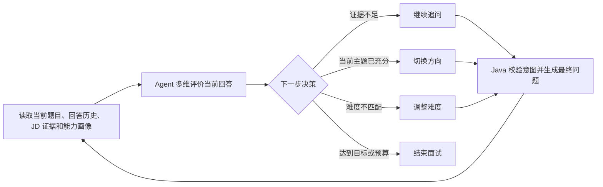
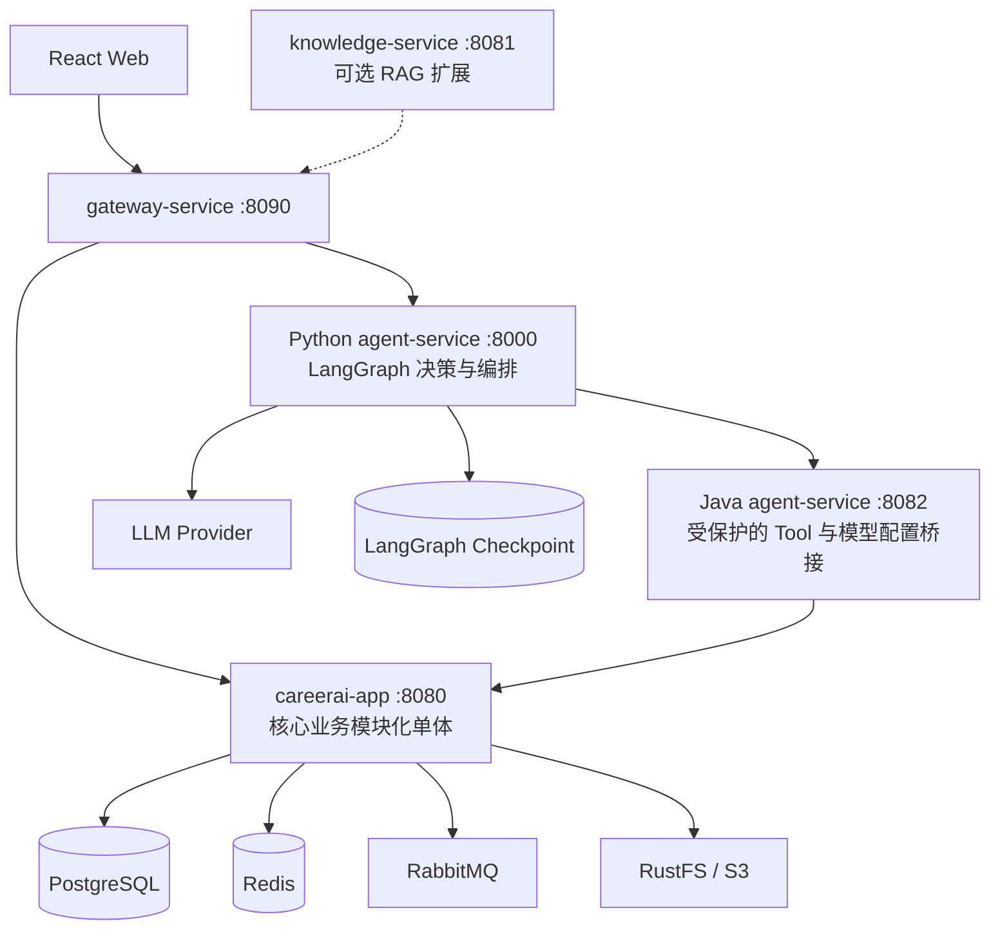
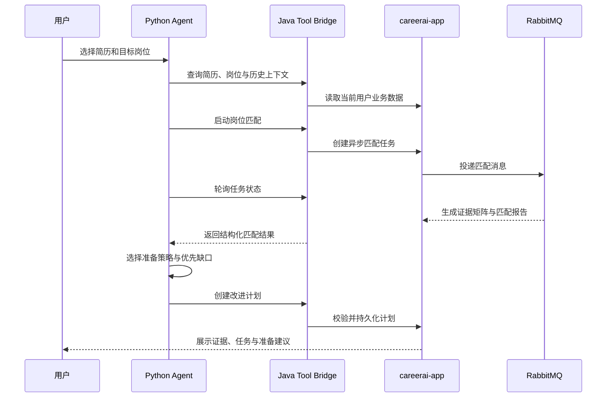

# CareerAI

CareerAI 是一个面向实习与校招场景的 **Agent 驱动求职训练平台**。

项目重点不是给传统系统增加一个聊天框，而是让 Agent 在受控边界内读取简历、岗位、匹配报告和历史能力画像，自主决定下一步，并直接调用 Java 业务能力完成创建任务、等待异步结果、增量出题和持久化。

当前项目收束为两条核心闭环：

- **简历–JD–规划**：从岗位要求和简历证据出发，生成可解释、可执行的准备计划。
- **自适应模拟面试**：根据当前回答和跨场次能力画像，动态决定追问、换题、难度及结束时机。

> 当前状态：核心闭环已完成，可作为 Java 后端工程能力与 Agent 应用开发能力的综合展示项目。演示步骤见 [项目收口说明](docs/PROJECT-CLOSEOUT.md)。

## 项目亮点

### 1. Agent 直接调用业务，而不是停留在问答

Python Agent 通过 LangChain Structured Tools 调用 Java 内部业务接口，能够实际执行：

- 查询用户简历、目标岗位和匹配报告；
- 启动异步岗位匹配任务并等待结果；
- 根据证据差距选择准备策略并创建改进计划；
- 读取面试上下文和长期能力画像；
- 创建面试蓝图、执行追问/换题/调难度/结束决策；
- 将 Agent 结果保存为可再次查询的普通业务数据。

所有写操作仍由 Java 完成权限校验、业务校验、事务控制和幂等处理。核心原则是：

> **Java 是业务事实的唯一所有者，Python Agent 是业务能力的决策与编排者。**

### 2. 证据驱动的简历–JD–规划

系统不是只输出一个模糊的匹配分数，而是建立 JD 要求与简历证据矩阵：

| 覆盖类型 | 含义 | 后续动作 |
| --- | --- | --- |
| `SUPPORTED` | 简历中存在可信证据 | 保留并强化表达 |
| `EXPRESSION_GAP` | 具备经历但表达不充分 | 优化简历描述 |
| `EVIDENCE_GAP` | 声称具备能力但缺少案例或指标 | 补充项目证据 |
| `CAPABILITY_GAP` | 当前证据无法证明具备能力 | 学习并安排验证任务 |

Agent 根据岗位要求的重要度、证据强度和缺口类型选择 `RESUME_FIRST`、`PROJECT_FIRST`、`INTERVIEW_FIRST` 或 `BALANCED` 策略，再调用 Java 创建带优先级、建议周期、验证方式和 JD 关联的准备任务。

### 3. 真正自适应的增量面试

Agent 会话只预生成首题，之后每轮都基于真实回答重新决策：



Python 只生成结构化 `NextQuestionIntent`，Java 再校验题型、难度、父题索引和真实 `requirementId`，并注入简历/JD 上下文生成最终题面，避免模型绕过业务规则。

面试还支持：

- 综合摸底、简历深挖、岗位定向、专项强化四种训练模式；
- 技术正确性、深度、完整性、场景分析、项目掌握、排障、表达和岗位相关性多维评价；
- 用户主动提示、讲解、跳过、继续和提前结束；
- 跨会话首题主题去重，简历更新版本后仍继承已考历史；
- 提示与讲解的 Markdown + Token 流式输出；
- 下一题生成过程的 SSE 实时阶段反馈。

### 4. 可追溯的持久能力画像

长期记忆不是无限保存聊天记录，而是由 Java 维护的结构化业务事实：

- 每次有效回答形成不可变能力观察；
- 同一场面试先聚合为一个样本，避免连续追问放大单场表现；
- 跨场次投影为 `CANDIDATE`、`STABLE`、`CONFLICT` 状态；
- 保存得分、置信度、趋势、证据片段、缺失点和最近验证时间；
- 新一场面试优先复测低分、下降、冲突和未完成训练项；
- 高分稳定项自动提升为场景设计或故障排查，而不是重复基础概念。

LangGraph Checkpoint 只负责当前 Agent Run 的恢复；能力画像负责跨 Run、跨面试的长期记忆，两者职责分离。

### 5. 可恢复、可审计的 Agent 执行链

- LangGraph 显式状态机，规划、等待、恢复和失败状态清晰可见；
- RabbitMQ 执行岗位匹配异步任务，Agent 根据任务状态暂停并恢复；
- Tool 调用携带 `X-Agent-Run-Id`、`X-Agent-Step-Id`；
- 写 Tool 使用稳定 `Idempotency-Key`，防止网络重试造成重复业务数据；
- 业务错误以结构化结果返回，前端可展示具体失败阶段；
- 前端工作台展示执行计划、步骤状态、决策依据、证据和最终业务产物。

### 6. Java 与 AI 工程边界清晰

- 核心业务保持模块化单体，避免为了展示技术栈机械拆分微服务；
- `Controller → Service → Repository` 分层，实体不直接暴露给接口；
- 外部 LLM、S3 和 HTTP 调用不放在数据库事务中；
- Spring AI Provider 访问统一收口在 `LlmProviderRegistry`；
- 结构化输出统一通过 `StructuredOutputInvoker`；
- Prompt 数据边界、用户资源隔离、内部服务令牌和 Tool 白名单共同限制 Agent 权限。

## 系统架构



### 组件职责

| 组件 | 核心职责 | 明确不负责 |
| --- | --- | --- |
| `frontend` | 业务页面、Agent 执行轨迹、流式面试交互 | 在浏览器中执行 Agent 决策 |
| `careerai-app` | 用户、简历、岗位、匹配、面试、画像、事务与持久化 | 跨业务长流程编排 |
| Java `backend/agent-service` | 内部令牌校验、Tool 白名单、模型配置和业务适配 | 保存 Agent Run 或直接持有业务表 |
| Python `agent-service` | LangGraph 状态机、规划、决策、等待与恢复 | 直接访问 Java 业务数据库 |
| `gateway-service` | `/api/**` 统一入口和服务路由 | 业务逻辑 |
| `knowledge-service` | 可选个人知识库与 RAG | 核心求职闭环的必需依赖 |

## 核心业务闭环

### 简历–JD–规划



### 自适应模拟面试

1. 创建面试前读取简历、JD、匹配证据、长期画像和未完成任务；
2. Agent 生成结构化面试蓝图，Java 过滤非法字段并创建会话；
3. 用户回答后，Agent 评价回答并决定追问、换题、调难度或结束；
4. Java 根据受控意图生成最终题面并保存问答与决策记录；
5. 面试结束后异步生成报告、结束总结和改进任务；
6. 能力观察投影为长期画像，参与下一场蓝图和下一轮岗位准备。

## 项目结构

```text
CareerAI/
├── frontend/                              # React 18 前端
│   └── src/
│       ├── api/                           # HTTP / SSE API 访问
│       ├── components/                    # 面试、岗位、简历等复用组件
│       ├── pages/                         # 页面级业务入口
│       ├── hooks/                         # 面试配置与页面逻辑
│       ├── types/                         # 前端共享类型
│       └── utils/                         # Token、日期等工具
│
├── agent-service/                         # Python Agent 决策与编排服务
│   ├── src/careerai_agent/
│   │   ├── api/                           # FastAPI 路由、鉴权依赖、SSE
│   │   ├── graph/                         # LangGraph 主图、面试图、创建图
│   │   ├── services/                      # 规划器、策略决策、蓝图、面试决策
│   │   ├── tools/                         # LangChain Tools、Java Client、契约模型
│   │   ├── models/                        # 动态模型配置与 ChatModel 工厂
│   │   ├── persistence/                   # Memory / PostgreSQL Checkpoint
│   │   └── domain/                        # Agent Run 与请求模型
│   ├── tests/                             # Python API 与业务编排测试
│   ├── pyproject.toml                     # uv、依赖和质量规则
│   └── uv.lock
│
├── backend/                               # Java 21 Maven 聚合工程
│   ├── careerai-shared/                   # JWT、Result、异常、Agent Tool 契约等
│   ├── careerai-app/                      # 核心业务模块化单体
│   │   └── modules/
│   │       ├── user/                      # 用户认证与隔离
│   │       ├── resume/                    # 简历上传、解析与分析
│   │       ├── job/                       # 目标岗位与 JD
│   │       ├── jobmatch/                  # 证据矩阵与异步岗位匹配
│   │       ├── resumeplan/                # 简历改进与准备任务
│   │       ├── interview/                 # 增量面试、评价、画像与收尾
│   │       ├── llmprovider/               # 动态模型 Provider 管理
│   │       └── agenttool/                 # 核心业务 Tool 实现
│   ├── agent-service/                     # Java 内部 Tool / 配置桥接
│   ├── gateway-service/                   # Spring Cloud Gateway MVC
│   └── knowledge-service/                 # 可选知识库 / RAG 服务
│
├── docs/                                  # 架构、边界、迁移与收口文档
│   └── sql/                               # PostgreSQL 增量迁移脚本
├── scripts/
│   ├── dev-start.sh                       # 启动默认演示主链
│   └── smoke-test.sh                      # 服务就绪检查
├── .env.example
└── README.md
```

注意：仓库根目录的 `agent-service/` 是 Python 编排服务；`backend/agent-service/` 是 Java 内部桥接服务。

## 已实现功能

### 求职准备

- 简历上传、Apache Tika 文本解析、S3 兼容对象存储；
- 简历结构化分析和历史版本管理；
- 目标岗位维护与 JD 解析；
- RabbitMQ 异步岗位匹配；
- JD 要求–简历证据矩阵；
- 匹配报告、简历改进计划和结构化准备任务；
- Agent 工作台展示执行步骤、决策依据和产物。

### 自适应面试

- 四种训练模式与结构化面试蓝图；
- 首题候选生成和跨会话主题去重；
- 基于回答的增量出题、追问、换题和难度调整；
- 用户控制意图识别和提前结束；
- 多维单轮评价、完整/部分面试报告；
- 持久能力观察、画像投影和趋势；
- 结束总结、改进任务和下一场复测建议；
- Markdown 消息渲染、Token 流式讲解和 SSE 执行阶段反馈。

### 平台能力

- JWT 登录和用户级资源隔离；
- 多 LLM Provider 配置、测试与默认模型切换；
- Java Agent 内部访问令牌和 Tool 白名单；
- 幂等写入、结构化业务错误和异步重试；
- Gateway 统一路由；
- 可选知识库与 RAG 扩展。

## 技术栈

| 层次 | 技术 |
| --- | --- |
| Java | Java 21、Spring Boot、Spring AI、Spring Cloud Gateway MVC、OpenFeign、JPA |
| Agent | Python 3.12、uv、FastAPI、Pydantic、LangChain、LangGraph |
| Frontend | React 18、TypeScript、Vite、Tailwind CSS、Framer Motion、React Markdown |
| Data | PostgreSQL、Redis、RabbitMQ、RustFS / S3 |
| Quality | Maven、JUnit 5、Pytest、Ruff、Mypy、pnpm、TypeScript |

## 本地启动

### 1. 基础设施

| 服务 | 默认端口 | 用途 |
| --- | --- | --- |
| PostgreSQL | `5432` | 核心业务数据和可选 Checkpoint |
| Redis | `6379` | 会话缓存与异步流 |
| RabbitMQ | `5672 / 15672` | 岗位匹配任务 |
| RustFS / S3 | `9000 / 9001` | 简历文件存储 |

Nacos 和 `knowledge-service` 不是默认演示依赖。复制配置并确保三个 Agent 相关服务使用同一个内部令牌：

```bash
cp .env.example .env
sdk env
```

关键配置：

```env
NACOS_DISCOVERY_ENABLED=false
NACOS_REGISTER_ENABLED=false
APP_RABBITMQ_ENABLED=true
AGENT_INTERNAL_SERVICE_TOKEN=replace-with-the-same-local-token
```

### 2. 一键启动默认主链

```bash
./scripts/dev-start.sh
```

该脚本启动：

- `careerai-app`
- Java `agent-service`
- Python `agent-service`
- `gateway-service`
- React 前端

就绪检查：

```bash
./scripts/smoke-test.sh
```

### 3. 分别启动

Java：

```bash
cd backend
mvn clean install
mvn -pl careerai-app spring-boot:run
mvn -pl agent-service spring-boot:run
mvn -pl gateway-service spring-boot:run
```

Python Agent：

```bash
cd agent-service
uv sync
cp .env.example .env
uv run uvicorn careerai_agent.main:app --reload --port 8000
```

前端：

```bash
cd frontend
corepack enable
pnpm install --frozen-lockfile
pnpm dev
```

### 4. 服务地址

| 服务 | 地址 |
| --- | --- |
| React | `http://localhost:5173` |
| Gateway | `http://localhost:8090` |
| Java 核心 | `http://localhost:8080` |
| Java Agent 桥接 | `http://localhost:8082` |
| Python Agent | `http://localhost:8000` |

Gateway 路由：

- `/api/agent/**` → Python Agent `8000`
- `/api/knowledgebase/**`、`/api/rag-chat/**` → 可选 Knowledge Service `8081`
- 其他 `/api/**` → Java 核心 `8080`

## 推荐演示路径

### 路径一：简历–JD–规划

1. 上传并分析一份简历；
2. 在“目标岗位”中录入 JD；
3. 启动岗位匹配，查看要求–证据矩阵；
4. 进入 Agent 工作台，观察异步等待、策略决策和 Tool 执行；
5. 查看落库后的改进计划和准备任务。

### 路径二：自适应模拟面试

1. 选择已有简历和目标岗位；
2. 选择综合摸底、简历深挖、岗位定向或专项强化；
3. 回答问题，观察 Agent 的评分、动作、依据及下一题变化；
4. 请求提示或讲解，查看 Markdown 流式输出；
5. 结束面试，查看能力画像、改进任务和下一场复测建议；
6. 再次创建面试，验证历史弱点复测和已掌握主题升难度。

## 验证

```bash
# Java 全模块
cd backend && mvn test

# Python Agent
cd agent-service
uv run pytest
uv run ruff check src tests
uv run mypy src

# React
cd frontend && pnpm build
```

## 项目边界

为了保证简历项目的完整度和可解释性，当前明确不继续扩展：

- 自动投递和招聘网站账号连接；
- 邮件、日历和第三方办公平台集成；
- ASR、TTS 和完整语音面试；
- Multi-Agent 互相讨论式架构；
- 为展示技术栈继续拆分用户、简历、岗位或面试微服务。

后续若继续迭代，优先级较高的方向是：

- 面试结果自动修正岗位准备计划；
- 多份简历基于岗位证据并行比较；
- 时间衰减与间隔复测；
- 更完整的 Run / Step / ToolCall / Memory Update 审计；
- 固定评测集与规划准确率、问题选择质量评估。

## 相关文档

- [项目收口与演示说明](docs/PROJECT-CLOSEOUT.md)
- [Agent 化改造方案](docs/CareerAI-Agent化改造方案.md)
- [改造工作清单](docs/CareerAI-改造工作清单.md)
- [数据库边界](docs/database-boundaries.md)
- [数据库迁移脚本](docs/sql)

## 上游与许可证

本项目基于 [Snailclimb/interview-guide](https://github.com/Snailclimb/interview-guide) 修改。上游项目使用 AGPL-3.0 License；本仓库保留原许可证、上游来源和修改说明，详见 [NOTICE.md](NOTICE.md)。
