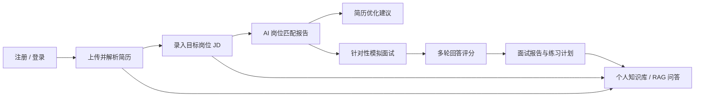
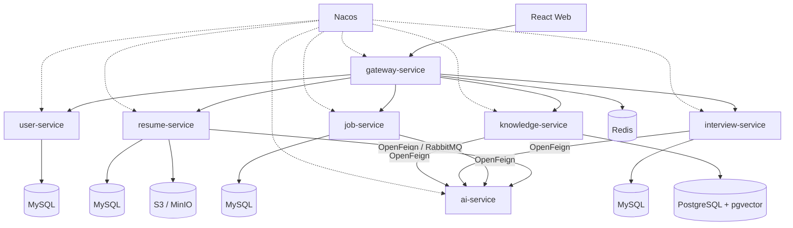

# CareerAI

面向大学生实习与校招场景的智能求职辅助和模拟面试平台。

CareerAI 基于 [InterviewGuide](https://github.com/Snailclimb/interview-guide) 进行二次开发，围绕“简历、目标岗位和面试表现”建立完整的求职闭环，而不是仅对上游项目进行改名或界面换皮。

> 当前状态：已从上游提交 `8c80a195` 完成源码迁移，目录调整为 `frontend + backend`，后端已从 Gradle 转换为 Java 21 Maven 聚合工程。核心业务闭环已进入可演示阶段，微服务拆分已先抽出 `knowledge-service` 作为知识库/RAG 服务。

## 项目定位

CareerAI 面向个人求职者，核心流程如下：



## 当前基线能力

- 简历上传、Tika 文本解析、内容去重和结构化 AI 诊断。
- 用户认证、岗位中心、JD 解析、简历-岗位匹配报告、简历改进计划和综合求职报告。
- 文字模拟面试、Skill 出题、智能追问、回答评分和报告导出。
- 基于 PostgreSQL + pgvector 的个人知识库和 RAG 问答。
- 基于 Redis Stream 的简历分析、知识库向量化和面试评估异步任务。
- 基于 RabbitMQ 的简历-岗位匹配异步任务链路，支持任务状态追踪、手动 ACK、失败重试和死信队列。
- Spring AI 多 Provider、结构化输出重试和 Prompt 模板。
- 基于 SSE 的 AI 回答和任务进度流式返回。

Spring Cloud Alibaba 微服务拆分仍属于 CareerAI 后续改造目标，不是当前已完成功能。

## 与上游项目的差异

| 方向 | 上游现状 | CareerAI 改造目标 |
| --- | --- | --- |
| 产品主线 | 简历分析、模拟面试、知识库等功能集合 | 登录 → 简历 → 岗位 → 匹配 → 面试 → 改进计划 |
| 用户体系 | 缺少完整认证，部分数据没有用户隔离 | JWT 登录、令牌刷新、全资源归属和越权测试 |
| 岗位能力 | 没有独立岗位与匹配模型 | 岗位中心、JD 解析、证据化匹配报告 |
| 应用架构 | Spring Boot 单体 | 业务稳定后拆分为 Spring Cloud Alibaba 微服务 |
| 异步任务 | Redis Stream | RabbitMQ Confirm、ACK、重试、死信、幂等和补偿 |
| 数据存储 | PostgreSQL + pgvector | MySQL 存业务数据，PostgreSQL + pgvector 存向量数据 |
| 面试上下文 | 以通用 Skill 和简历为主 | 由用户、简历、目标岗位和知识库共同驱动 |

## 目标技术栈

### 后端

- Java 21、Spring Boot、Spring Cloud Alibaba
- Spring AI、Nacos、Spring Cloud Gateway、OpenFeign
- RabbitMQ、Redis、MySQL、PostgreSQL + pgvector
- Apache Tika、S3 兼容对象存储、SSE
- Maven、JUnit 5、Testcontainers

### 前端

- React、TypeScript、Vite、Tailwind CSS
- React Router、Axios、Recharts

### 工程化

- 本地 Docker 中间件、GitHub Actions
- OpenAPI、Micrometer、结构化日志与 Trace ID

> 上述列表是目标技术栈，不代表当前仓库中的所有能力均已完成。只有通过实现、测试和演示验收的能力才会写入最终项目简历。

## 目标架构



计划中的服务边界：

| 服务 | 职责 |
| --- | --- |
| `gateway-service` | 路由、CORS、JWT 初检、限流、Trace ID |
| `user-service` | 注册、登录、刷新/注销、个人资料 |
| `resume-service` | 简历文件、文本解析、分析任务和报告 |
| `job-service` | 岗位管理、JD 解析和匹配报告 |
| `interview-service` | 面试会话、题目、回答、评估和报告 |
| `knowledge-service` | 文档、分块、向量化、检索和 RAG 会话 |
| `ai-service` | Spring AI、Prompt、结构化输出和模型调用审计 |

## 改造原则

1. 先完成业务闭环，再拆微服务，避免产生只有 CRUD 和配置的空服务。
2. 每条 AI 结论尽量附带简历或 JD 原文证据，降低模型幻觉。
3. 用户数据隔离先于服务拆分，所有资源查询同时校验资源 ID 和当前用户。
4. 关系数据和向量数据职责分离；如果无法说明两种数据库的必要性，就只保留 PostgreSQL。
5. Redis 和 RabbitMQ 职责分离，不让两套消息机制处理同一种任务。
6. 简历中的技术描述必须有代码、自动化测试或故障演练支撑。

## 路线图

- [x] 盘点上游功能、依赖、测试和架构差距。
- [x] 输出 CareerAI 目标业务闭环和改造工作清单。
- [x] 导入干净的上游代码并调整为 `frontend + backend` 目录。
- [x] 将后端从 Gradle 转换为 Java 21 Maven 聚合工程。
- [x] 修复并验证前端构建、后端编译和测试基线。
- [x] 将 Java 包名迁移为 `com.yzh666.careerai`。
- [x] 实现用户认证和全链路数据隔离。
- [x] 实现岗位中心、JD 解析和岗位匹配报告。
- [x] 将简历-岗位匹配迁移为 RabbitMQ 可靠异步链路。
- [x] 完成面向目标岗位的文字模拟面试。
- [x] 完成 RAG 来源引用、元数据过滤和聊天记录来源持久化。
- [x] 抽出第一阶段 `knowledge-service`，独立承载知识库、向量化和 RAG 会话。
- [x] 接入 Gateway 和 Nacos，完成基于服务发现的网关路由。
- [x] 接入 OpenFeign，打通主应用到知识库服务的服务间调用。
- [ ] 逐步从主应用移除已拆分 Controller。
- [ ] 完成端到端测试、可观测性、部署和项目演示材料。

完整任务和验收标准见 [CareerAI 改造工作清单](docs/CareerAI-改造工作清单.md)。

## 当前目录

```text
CareerAI/
├── frontend/                         # React + TypeScript + Vite
├── backend/
│   ├── pom.xml                       # Maven 父工程
│   ├── gateway-service/              # API 网关，按路径路由到主应用和知识库服务
│   │   ├── pom.xml
│   │   └── src/
│   ├── careerai-app/                 # 当前主应用，保留完整业务闭环
│   │   ├── pom.xml
│   │   └── src/
│   └── knowledge-service/            # 第一阶段拆出的知识库/RAG 服务
│       ├── pom.xml
│       └── src/
├── docs/
│   └── CareerAI-改造工作清单.md
├── .env.example
├── .sdkmanrc
├── AGENTS.md
├── LICENSE
├── NOTICE.md
└── README.md
```

后续会继续在 `backend/` 下增加用户、简历、岗位、面试和 AI 服务模块，并逐步把已拆出的能力从 `careerai-app` 迁移到独立服务调用。

## 本地开发

项目不使用 Docker Compose，应用直接连接本机 Docker 中已经存在的中间件：

| 能力 | 本地容器 | 端口 | 当前阶段 |
| --- | --- | --- | --- |
| PostgreSQL + pgvector | `v-postgres` | `5432` | 必需 |
| Redis | `dev-redis7` | `6379` | 必需 |
| RustFS / S3 | `v-rustfs` | `9000/9001` | 必需 |
| MySQL | `mysql8` | `3306` | 用户/岗位服务拆分时接入 |
| RabbitMQ | `rabbitmq` | `5672/15672` | 开启 `APP_RABBITMQ_ENABLED=true` 后用于岗位匹配异步链路 |
| Nacos | `nacos` | `8848/9848/9849` | 服务注册与发现 |

本地 PostgreSQL 容器中需要独立的 `careerai` 数据库和 `vector` 扩展。复制配置模板并填写本机已有容器的真实凭证：

```bash
cp .env.example .env
sdk env
```

启动后端：

```bash
cd backend
mvn clean test
mvn -pl careerai-app spring-boot:run
```

启动已拆出的知识库/RAG 服务：

```bash
cd backend
mvn -pl knowledge-service spring-boot:run
```

启动网关：

```bash
cd backend
mvn -pl gateway-service spring-boot:run
```

默认端口：主应用 `8080`，知识库服务 `8081`，网关 `8090`。当前阶段服务仍连接同一套本地 PostgreSQL、Redis、RabbitMQ、RustFS 和 Nacos，中间件仍直接使用本地 Docker 容器，不使用 Docker Compose。

启动本地 Nacos：

```bash
docker run -d --name nacos \
  -e MODE=standalone \
  -p 8848:8848 -p 9848:9848 -p 9849:9849 \
  nacos/nacos-server:v2.4.3
```

服务注册默认读取：

```env
NACOS_DISCOVERY_ENABLED=true
NACOS_REGISTER_ENABLED=true
NACOS_SERVER_ADDR=localhost:8848
NACOS_NAMESPACE=
NACOS_GROUP=DEFAULT_GROUP
```

服务仍默认注册到 Nacos。为了避免本地单机开发时网关通过机器局域网 IP 复用失效连接，网关路由默认直连本地端口：

| 路径 | 转发目标 |
| --- | --- |
| `/api/knowledgebase/**` | `http://localhost:8081` |
| `/api/rag-chat/**` | `http://localhost:8081` |
| 其它 `/api/**` | `http://localhost:8080` |

如需验证 Nacos 负载均衡路由，可在启动 `gateway-service` 前设置：

```env
GATEWAY_APP_ROUTE_URI=lb://careerai-app
GATEWAY_KNOWLEDGE_ROUTE_URI=lb://knowledge-service
```

主应用通过 OpenFeign 调用知识库服务：

| 主应用接口 | 内部调用 |
| --- | --- |
| `/api/system/downstreams/knowledge-service/health` | `careerai-app -> OpenFeign -> knowledge-service /actuator/health` |

启动前端：

```bash
cd frontend
corepack enable
pnpm install --frozen-lockfile
pnpm dev
```

默认访问地址：前端 `http://localhost:5173`，主应用 Swagger UI `http://localhost:8080/swagger-ui.html`，API 网关 `http://localhost:8090`。
前端开发代理默认走 API 网关 `http://localhost:8090`，需要同时启动 `gateway-service`、`careerai-app`、`knowledge-service` 和 Nacos。若临时只启动主应用调试，可设置 `VITE_API_PROXY_TARGET=http://localhost:8080` 直连 `careerai-app`。

## 开发顺序建议

第一阶段只完成以下链路：

1. 用户注册和登录。
2. 上传并解析简历。
3. 新建目标岗位并解析 JD。
4. 生成有原文证据的岗位匹配报告。
5. 基于简历和岗位发起文字模拟面试。
6. 生成面试报告和下一步练习计划。

ASR/TTS 语音面试、日历、HR 企业端、招聘网站爬虫和支付功能暂不进入首版范围。

## 上游与许可证

本项目基于 [Snailclimb/interview-guide](https://github.com/Snailclimb/interview-guide) 修改。上游项目使用 AGPL-3.0 License；本仓库保留原许可证、上游来源和修改说明，并按许可证要求公开对应源码。导入版本和迁移说明见 [NOTICE.md](NOTICE.md)。

项目完成前，请勿将尚未实现或未验证的目标能力作为已完成成果写入简历。
