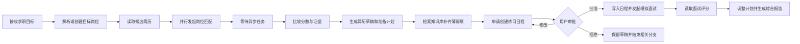
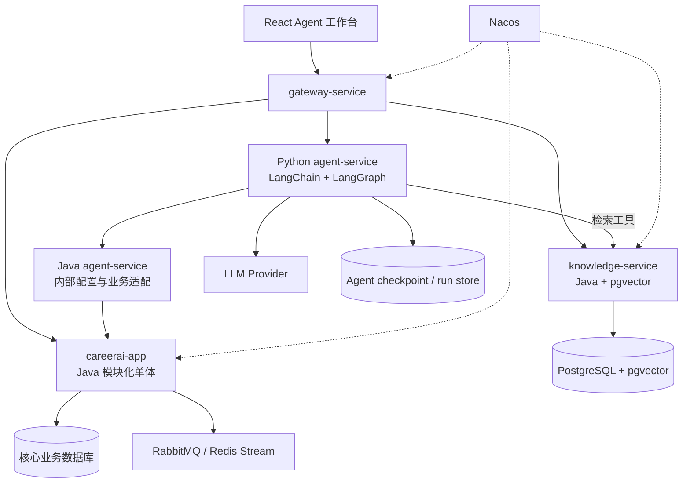

# CareerAI Agent 化改造方案

> 文档目标：将 CareerAI 改造成能够直接调用求职业务能力、持续推进任务并交付结果的执行型 Agent 系统。  
> 核心约束：不建设以闲聊和单轮问答为主的“对话 Agent”，不让大模型绕过 Java 业务层直接操作数据库或外部系统。

> 架构决策说明：本文基于当前已经落地的“`careerai-app` 模块化单体 + `knowledge-service`”边界制定。旧版《CareerAI 改造工作清单》中继续拆分多个业务服务的目标架构属于早期规划；涉及后续服务拆分时，以本文和《数据库边界与拆分路线》的当前结论为准。

## 1. 结论先行

CareerAI 的 Agent 化方向应定义为“求职任务执行 Agent”，而不是在现有页面旁边增加一个聊天框。

用户提供的是目标，例如：

> 我准备投递某公司的 Java 后端实习。请从我的简历中选择最合适的一份，找出差距，在周五前安排准备，并完成一次针对性模拟面试。

Agent 接收目标后，需要主动完成以下业务动作：

1. 解析并保存目标岗位。
2. 获取用户拥有的可用简历。
3. 为候选简历发起岗位匹配任务并等待结果。
4. 根据匹配证据选择更合适的简历，而不是只比较一个总分。
5. 生成简历修改草稿和岗位准备计划。
6. 从个人知识库检索薄弱知识点对应的学习材料。
7. 根据截止时间和现有日程安排练习任务。
8. 在用户批准后创建模拟面试日程。
9. 面试结束后读取评分，动态调整后续练习计划。
10. 汇总简历、岗位匹配、面试和改进计划，生成最终求职报告。
11. 在用户确认真实投递后，将岗位状态更新为 `APPLIED`。

这条链路同时体现规划、工具调用、异步等待、条件分支、人工审批、失败恢复和结果验证，能够与普通问答助手形成明确差异。

## 2. 产品边界

### 2.1 要建设的能力

- 用户用自然语言或结构化表单描述一个求职目标。
- Agent 将目标拆成可观察、可暂停、可恢复的执行步骤。
- Agent 只能通过有明确参数和权限边界的业务工具执行动作。
- Agent 根据工具返回的真实业务数据决定下一步。
- 长时间运行的匹配、分析和向量化任务可以暂停等待，完成后继续执行。
- 高风险写操作必须由用户批准，可批准、修改参数或拒绝。
- 每一步都记录输入、输出、耗时、错误、重试和关联业务资源。
- 任务结束时必须产生业务产物，而不只是生成一段自然语言回复。

业务产物包括：

- 已保存的目标岗位；
- 可追溯的岗位匹配报告；
- 简历修改草稿及 Diff；
- 带截止时间的准备任务；
- 已创建的面试日程；
- 已完成的模拟面试和评分报告；
- 更新后的岗位状态；
- 可导出的综合求职报告。

### 2.2 明确不做的内容

- 不把知识库问答页面改名为 Agent 页面。
- 不以“模型回答得像不像人”作为 Agent 的主要验收标准。
- 不允许模型直接生成 SQL、调用 Repository 或访问业务数据库。
- 不允许 Python 服务成为第二套用户、简历、岗位或面试数据写入方。
- 不把每个业务模块拆成一个 Agent 或一个微服务。
- 不在首版实现多个 Agent 互相讨论但没有业务动作的演示。
- 不自动删除资源、发送邮件、真实投递岗位或修改正式简历。
- 不把 MCP、Multi-Agent、长期记忆等技术名词当成独立需求。

### 2.3 执行型 Agent 与对话 Agent 的区别

| 维度 | 对话 Agent | CareerAI 执行型 Agent |
| --- | --- | --- |
| 输入 | 一条问题 | 一个包含目标、约束和截止时间的任务 |
| 主要输出 | 一段回答 | 岗位、报告、草稿、日程、任务等业务产物 |
| 业务交互 | 查询后组织语言 | 连续调用查询和写入工具 |
| 状态 | 消息历史 | 结构化任务状态、步骤、资源和 checkpoint |
| 决策 | 决定怎么回答 | 决定下一步调用哪个业务工具 |
| 长任务 | 通常等待单次请求结束 | 可挂起、恢复、重试和补偿 |
| 风险控制 | 内容过滤 | 权限、审批、幂等、资源版本和审计 |
| 完成条件 | 模型停止输出 | 目标满足且业务结果经过验证 |

## 3. 首版核心场景

### 3.1 P0：求职作战 Agent

这是首版唯一必须完整实现的 Agent 主线。



动态决策至少包括：

- 没有可用简历时，暂停任务并要求用户上传，而不是编造简历内容。
- 有多份简历时，根据岗位匹配证据选择，不使用文件更新时间代替匹配判断。
- 匹配任务未完成时进入等待状态，不让模型反复调用创建接口。
- 匹配分数低于阈值时，先生成改进计划；达到阈值时可以直接安排模拟面试。
- 日程冲突时重新规划时间，不覆盖已有日程。
- 面试薄弱项变化后，更新尚未完成的练习任务，不修改已完成记录。

完成标准：Agent 最终至少生成一个匹配报告、一份准备计划和一份可查看的综合报告；所有写操作可追溯到同一个 `agentRunId`。

### 3.2 P1：面试邀约处置 Agent

输入可以是用户粘贴的邀约文本，后续再接入邮件和日历系统。

执行动作：

1. 解析公司、岗位、时间、形式、地点和联系人。
2. 查找并关联已有目标岗位；无法唯一匹配时请求用户选择。
3. 检查时间冲突。
4. 更新岗位状态为 `INTERVIEW`。
5. 创建面试日程。
6. 基于岗位、简历缺口和历史面试表现生成准备计划。
7. 起草确认回复；发送前必须审批。

这个场景的价值在于 Agent 同时调用邀约解析、岗位、日程、匹配和准备计划能力，而不是只把邀约文本总结一遍。

### 3.3 P1：自适应模拟面试 Agent

模拟面试仍然采用文字交互，但 Agent 能力不能只体现在“多轮聊天”。它必须根据回答结果修改业务状态：

- 根据当前回答评分决定追问、换题或结束当前方向；
- 从指定知识库检索依据，记录题目和参考来源；
- 根据岗位权重调整剩余题目分布；
- 将低分知识点写入准备任务；
- 面试结束后更新简历改进计划和综合求职报告。

### 3.4 P2：投递跟踪 Agent

- 找出长时间没有状态变化的岗位；
- 生成跟进建议或邮件草稿；
- 创建跟进提醒；
- 用户确认后更新岗位状态；
- 根据拒绝、面试或 Offer 结果调整后续岗位策略。

首版不直接登录第三方招聘网站自动投递，避免账号凭证、验证码、平台规则和错误投递风险。

## 4. 目标架构

### 4.1 部署单元



保留现有“模块化单体 + 独立知识服务”架构，并增加两个职责不同的 Agent 部署单元：Python `agent-service` 负责状态机与模型编排，Java `backend/agent-service` 负责受保护的内部配置和业务能力适配。不继续拆分 `user-service`、`resume-service`、`job-service` 和 `interview-service`。

`agent-service` 首版可以由 Gateway 通过环境变量配置固定内部地址，不强制 Python 接入 Nacos。只有在部署实例数、动态扩缩容或统一服务治理产生实际需求时，再补充 Python 的服务注册与发现。

### 4.2 职责划分

| 组件 | 负责 | 不负责 |
| --- | --- | --- |
| `gateway-service` | 统一入口、路由、JWT 初检、限流、Trace ID、SSE 转发 | Agent 规划和业务查询 |
| `careerai-app` | 权限、业务规则、事务、业务表、任务状态、MQ、幂等 | Agent 长流程和跨模块自主规划 |
| `knowledge-service` | 文档、向量化、检索、引用来源和 RAG 数据 | 核心业务状态写入 |
| Python `agent-service` | 目标解析、计划、工具选择、checkpoint、审批等待、恢复、动态模型初始化 | 直接访问业务表或保存 Provider 配置 |
| Java `backend/agent-service` | 内部令牌校验、模型配置桥接、后续业务工具适配 | Provider 持久化、业务表、Agent 状态机 |
| React 前端 | 任务创建、执行时间线、审批、产物展示 | 在浏览器中执行 Agent 业务逻辑 |

### 4.3 Java 与 Python 的边界

Java 是业务事实的唯一写入方，Python 是业务能力的编排方。

- Python 通过稳定、结构化的 HTTP 工具调用 Java。
- `careerai-app` 是 Provider 配置唯一数据源；Java Agent 桥接只转发当前 Agent 默认模型的运行时快照。
- Python 每个 Run 拉取配置，以 `providerId + configVersion` 缓存模型；后台切换 Provider 后无需重启。
- Java 继续使用 `Controller -> Service -> Repository`，Agent 工具适配层只调用 Service。
- Java 从 JWT 或可信服务身份中恢复当前用户，不能相信模型提交的 `userId`。
- Python 只能保存 Agent 自己的 run、step、checkpoint 和审批状态。
- Java 事务只覆盖本地数据库操作，不在事务内调用 LLM、Python 或外部 HTTP。
- `careerai-shared` 继续只服务 Java 模块，不复制到 Python。
- Python 与 Java 共享 OpenAPI/JSON Schema 契约，不共享 JPA Entity。

### 4.4 现有 Spring AI 的处理方式

首版不需要立即迁移现有 Spring AI 逻辑：

- JD 解析、简历分析、岗位匹配、面试评分等成熟能力继续留在 Java，作为可被 Agent 调用的领域能力。
- Python LangChain/LangGraph 负责跨领域规划、工具选择、等待和恢复。
- Java 中已有的 `StructuredOutputInvoker` 和 `LlmProviderRegistry` 继续承担结构化领域输出和 Provider 管理。
- Agent 规划模型通过受保护的内部配置链路统一选择；Java 领域 AI 调用仍继续使用现有 Spring AI Registry。

这样可以先证明 Agent 调业务的价值，避免一开始同时重写所有 AI 功能。

## 5. Agent 业务工具设计

### 5.1 工具设计原则

每个工具必须满足：

1. 名称表达一个业务动作，而不是一个底层 URL。
2. 输入使用受约束的结构化 Schema，不接收任意 JSON。
3. 返回业务 DTO、明确错误码和是否允许重试。
4. 查询工具和写入工具分开，禁止一个工具根据隐藏条件决定是否写库。
5. 写工具支持幂等键；更新工具支持资源版本或等价的并发控制。
6. 工具描述必须写清前置条件、成功效果和禁止使用的场景。
7. 工具执行前后都记录 `agentRunId`、`agentStepId` 和 `toolCallId`。
8. 工具调用失败后由确定性错误策略决定重试，不让模型无限尝试。

推荐统一返回结构：

```json
{
  "toolCallId": "tc_01",
  "success": true,
  "data": {},
  "errorCode": null,
  "errorMessage": null,
  "retryable": false,
  "resourceVersion": 3,
  "auditId": "audit_01"
}
```

### 5.2 可直接复用的读取工具

| Agent Tool | 现有接口 | 用途 |
| --- | --- | --- |
| `list_resumes` | `GET /api/resumes` | 获取当前用户可用简历 |
| `get_resume_detail` | `GET /api/resumes/{id}/detail` | 读取简历文本和分析结果 |
| `list_target_jobs` | `GET /api/jobs` | 获取目标岗位和状态 |
| `get_target_job` | `GET /api/jobs/{id}` | 获取 JD 和结构化方向 |
| `list_job_match_reports` | `GET /api/job-matches` | 获取岗位已有匹配报告 |
| `get_job_match_task` | `GET /api/job-matches/tasks/{taskId}` | 查询异步匹配任务状态 |
| `list_interview_sessions` | `GET /api/interview/sessions` | 获取历史模拟面试 |
| `get_interview_report` | `GET /api/interview/sessions/{sessionId}/report` | 获取面试评分和薄弱项 |
| `list_interview_schedules` | `GET /api/interview-schedule` | 检查日程冲突 |
| `get_career_report` | `GET /api/career-reports/{matchReportId}` | 获取综合报告 |
| `search_knowledge_bases` | `GET /api/knowledgebase/search` | 找到可用知识库 |
| `query_knowledge_base` | `POST /api/knowledgebase/query` | 为准备任务检索依据 |

### 5.3 可直接复用的执行工具

| Agent Tool | 现有接口 | 风险级别 | 审批策略 |
| --- | --- | --- | --- |
| `parse_job_description` | `POST /api/jobs/parse-jd` | 只读计算 | 自动执行 |
| `create_target_job` | `POST /api/jobs` | 低风险写入 | 首版可自动，结果可撤销 |
| `start_job_match` | `POST /api/job-matches/tasks` | 异步计算/计费 | 默认自动，受配额限制 |
| `create_improvement_plan` | `POST /api/resume-improvement-plans` | 生成业务产物 | 自动执行 |
| `parse_interview_invitation` | `POST /api/interview-schedule/parse` | 只读计算 | 自动执行 |
| `create_mock_interview` | `POST /api/interview/sessions` | 创建会话 | 用户已明确要求时自动 |
| `complete_mock_interview` | `POST /api/interview/sessions/{id}/complete` | 状态终结 | 必须审批 |
| `create_interview_schedule` | `POST /api/interview-schedule` | 外部时间承诺 | 必须审批 |
| `update_interview_schedule` | `PUT /api/interview-schedule/{id}` | 修改时间 | 必须审批 |
| `update_job_status` | `PATCH /api/jobs/{id}/status` | 改变求职事实 | `APPLIED/OFFER/REJECTED` 必须审批 |

删除岗位、简历、面试、知识库和日程的接口不进入首版 Agent 工具集。

### 5.4 必须新增的业务工具

#### `create_resume_draft`

根据原简历、目标岗位和改进计划生成新版本草稿，不覆盖原始简历。

输出至少包含：

- `draftId`；
- 原版本 ID；
- 目标岗位 ID；
- 修改后的结构化内容；
- 字段级或段落级 Diff；
- 每项修改对应的岗位要求和原简历证据；
- 无证据支撑、禁止写入正式简历的建议列表。

`publish_resume_version` 必须作为单独工具并要求审批。

#### `create_preparation_tasks`

将学习建议转换为真实任务，而不是只生成一段计划文本。

任务字段至少包括：

- 标题、类型、优先级和预计时长；
- 来源：匹配缺口、面试薄弱项或用户目标；
- 关联 `jobId`、`resumeId`、`matchReportId`、`sessionId`；
- 截止时间、状态和完成证据；
- Agent 创建原因和可追溯引用。

#### `reschedule_preparation_tasks`

根据截止时间、现有日程和任务完成情况调整未完成任务。已经完成的任务不能被 Agent 修改。

#### `verify_goal_completion`

通过业务查询验证目标是否完成，输出缺失产物和未完成条件。不能用模型的一句“任务已经完成”代替验证。

### 5.5 MCP 的定位

首版使用内部 REST/OpenAPI 工具即可。MCP 只作为可选协议适配层：

- MCP Server 不持有业务逻辑和数据库访问；
- MCP Tool 内部仍然调用 Java Service/API；
- 只有当同一批工具需要被 LangChain、IDE 或其他 Agent 客户端共同使用时再增加；
- 不为了展示 MCP 再拆一个拥有业务数据的新服务。

## 6. Agent 执行模型

### 6.1 使用 LangGraph 管理长流程

LangChain 用于模型、工具和中间件抽象，LangGraph 用于状态机、checkpoint、等待、恢复和人工审批。核心流程不应实现成一个无限 ReAct 循环。

建议状态节点：

```text
RECEIVED
  -> UNDERSTAND_GOAL
  -> LOAD_CONTEXT
  -> BUILD_PLAN
  -> EXECUTE_STEP
       -> WAITING_ASYNC
       -> WAITING_APPROVAL
       -> EVALUATE_RESULT
       -> RECOVERABLE_ERROR
  -> VERIFY_RESULT
  -> COMPLETED / PARTIALLY_COMPLETED / FAILED / CANCELLED
```

确定性逻辑负责：

- 状态迁移；
- 权限和审批策略；
- 最大步骤数与最大成本；
- 重试次数和退避；
- 异步任务等待；
- 幂等和重复调用检测；
- 目标完成验证。

模型负责：

- 从用户目标中提取约束；
- 在允许的工具集合中选择下一项能力；
- 根据多个业务结果进行解释性比较；
- 生成计划草稿和必要的用户说明；
- 在缺少关键输入时提出最少量的澄清问题。

### 6.2 Agent Run 状态

建议 Agent 状态至少包含：

```python
class CareerAgentState(TypedDict):
    run_id: str
    user_id: str
    goal: dict
    constraints: dict
    plan: list[dict]
    current_step: int
    resource_refs: dict[str, list[str]]
    pending_task_refs: list[dict]
    pending_approval: dict | None
    artifacts: list[dict]
    errors: list[dict]
    budget: dict
    status: str
```

消息历史只能作为辅助字段，不能成为唯一状态来源。

### 6.3 异步任务等待

岗位匹配、简历分析和知识库向量化可能由 MQ 异步执行。Agent 调用创建任务工具后：

1. 保存业务 `taskId` 和当前 checkpoint。
2. 将 run 标记为 `WAITING_ASYNC`。
3. 通过回调事件或有上限的轮询恢复执行。
4. 任务成功后进入结果评估节点。
5. 任务失败时根据 `retryable` 决定重试、降级或请求用户处理。

恢复后必须重新读取任务状态，不得假设任务已经成功。

### 6.4 人工审批

审批请求必须展示：

- Agent 准备执行的业务动作；
- 工具参数和影响的资源；
- 执行原因和依据；
- 预计产生的状态变化；
- 用户可选择“批准”“修改后批准”“拒绝”。

典型审批卡片：

```json
{
  "action": "create_interview_schedule",
  "reason": "岗位面试在 7 月 20 日，建议提前两天完成一次模拟面试",
  "arguments": {
    "jobId": 18,
    "startTime": "2026-07-18T19:30:00+08:00",
    "durationMinutes": 60
  },
  "effects": ["新增一条面试日程"],
  "allowedDecisions": ["approve", "edit", "reject"]
}
```

审批等待期间不占用数据库事务、HTTP 请求线程或模型调用。

### 6.5 Agent 对外接口

建议首版提供以下接口：

| 接口 | 用途 |
| --- | --- |
| `POST /api/agent/runs` | 创建一个目标任务并返回 `runId` |
| `GET /api/agent/runs/{runId}` | 获取当前状态、计划、产物和待处理事项 |
| `GET /api/agent/runs/{runId}/events` | 通过 SSE 订阅步骤和状态变化 |
| `POST /api/agent/runs/{runId}/approvals/{approvalId}` | 批准、编辑或拒绝待执行动作 |
| `POST /api/agent/runs/{runId}/pause` | 在安全节点暂停任务 |
| `POST /api/agent/runs/{runId}/resume` | 从 checkpoint 恢复任务 |
| `POST /api/agent/runs/{runId}/cancel` | 取消尚未执行的步骤，不回滚已完成业务事实 |
| `POST /api/agent/runs/{runId}/steps/{stepId}/retry` | 用户确认后重试可恢复的失败步骤 |

创建 run 的响应只需要返回任务标识和初始状态，不应保持 HTTP 请求直到整个求职任务完成。

## 7. 数据模型与审计

### 7.1 Python Agent 数据

建议 `agent-service` 独立拥有以下运行态数据：

#### `agent_runs`

- `id`
- `user_id`
- `goal_json`
- `status`
- `current_step`
- `started_at`、`updated_at`、`finished_at`
- `model_provider`、`model_name`
- `max_steps`、`token_budget`、`cost_budget`
- `result_summary_json`

#### `agent_steps`

- `id`
- `run_id`
- `step_index`
- `node_name`
- `tool_name`
- `tool_call_id`
- `arguments_json`
- `result_json`
- `status`
- `retry_count`
- `started_at`、`finished_at`
- `error_code`、`error_message`

#### `agent_approvals`

- `id`
- `run_id`
- `step_id`
- `action_name`
- `proposed_arguments_json`
- `decision`
- `decided_by`
- `decided_at`
- `edited_arguments_json`

checkpoint 使用 LangGraph 支持的持久化存储，不把完整 checkpoint 混入 Java 业务表。

### 7.2 Java 业务侧追踪

Python 调用 Java 时统一携带：

```text
Authorization: Bearer <user access token or delegated token>
X-Agent-Run-Id: <runId>
X-Agent-Step-Id: <stepId>
X-Tool-Call-Id: <toolCallId>
Idempotency-Key: <stable key for this business action>
X-Trace-Id: <traceId>
```

Java 日志、业务任务和 MQ 消息需要保留这些关联标识，形成从 Agent 计划到数据库结果的完整调用链。

## 8. 安全、幂等与失败恢复

### 8.1 权限

- 所有业务资源仍按当前登录用户过滤。
- Python 传入的资源 ID 必须由 Java 再次检查归属。
- Agent 工具采用最小权限白名单，不自动暴露全部 Controller。
- 根据运行阶段动态提供工具，减少模型误选高风险工具。
- 生产环境禁止匿名 Agent 执行业务写操作。

### 8.2 幂等

- 创建岗位、匹配任务、改进计划、日程和草稿必须支持 `Idempotency-Key`。
- 同一 run 恢复执行时复用原幂等键。
- Java 返回已存在结果时视为成功恢复，不再创建第二份数据。
- MQ 消费端继续按业务任务 ID 幂等，Agent 层不能代替消息幂等。

### 8.3 并发控制

- Agent 修改岗位状态、正式简历或日程前读取当前资源版本。
- 用户在 Agent 等待期间手工修改资源后，写工具应返回版本冲突。
- Agent 遇到版本冲突时重新加载上下文并重新规划，不能直接覆盖。

### 8.4 错误分类

| 错误类型 | 示例 | 处理方式 |
| --- | --- | --- |
| 参数错误 | JD 太短、时间非法 | 不重试，修改计划或请求用户补充 |
| 权限错误 | 资源不属于当前用户 | 立即终止相关分支并记录安全事件 |
| 瞬时错误 | 网络超时、模型限流 | 有上限的退避重试 |
| 异步业务失败 | 匹配任务进入死信 | 展示失败原因，允许用户批准重新发起 |
| 状态冲突 | 日程已修改、岗位已归档 | 重新加载上下文并重新规划 |
| 预算耗尽 | 达到步骤、Token 或成本上限 | 保存当前产物并标记部分完成 |

### 8.5 执行上限

每个 run 必须配置：

- 最大模型调用次数；
- 最大工具调用次数；
- 单工具最大重试次数；
- 最大运行时间；
- Token/费用预算；
- 相同工具和相同参数的重复调用熔断。

## 9. 前端改造

首版主界面应是“Agent 任务工作台”，不是传统左右气泡聊天页面。

### 9.1 页面结构

- 任务创建区：目标岗位、截止时间、可用简历、允许 Agent 执行的动作。
- 计划区：显示计划步骤、依赖关系和当前步骤。
- 执行时间线：展示工具名、状态、耗时、结果摘要和错误。
- 审批区：展示待批准写操作，可修改参数。
- 产物区：岗位、匹配报告、简历草稿、准备任务、面试和综合报告。
- 运行控制：暂停、恢复、取消和重新执行失败步骤。

自然语言输入可以保留，但用途是创建目标或补充约束，不是让用户持续陪 Agent 聊天才能推进任务。

### 9.2 前端状态

至少支持：

- `PLANNING`
- `RUNNING`
- `WAITING_ASYNC`
- `WAITING_APPROVAL`
- `PAUSED`
- `PARTIALLY_COMPLETED`
- `COMPLETED`
- `FAILED`
- `CANCELLED`

运行进度建议通过 SSE 推送；断线重连后根据 `runId` 补发当前快照，而不是依赖浏览器内存恢复。

## 10. 工程目录建议

```text
CareerAI/
├── frontend/
├── agent-service/
│   ├── pyproject.toml
│   ├── src/careerai_agent/
│   │   ├── api/                 # run、approval、stream 接口
│   │   ├── graph/               # LangGraph 状态、节点和路由
│   │   ├── tools/               # Java/knowledge 工具适配器
│   │   ├── policies/            # 审批、权限、预算、重试策略
│   │   ├── persistence/         # checkpoint、run、step
│   │   ├── models/              # Pydantic 输入输出模型
│   │   └── observability/       # trace、metrics、audit
│   └── tests/
├── backend/
│   ├── careerai-shared/
│   ├── agent-service/             # 无数据库的内部配置/业务能力适配层
│   ├── careerai-app/
│   │   └── modules/
│   │       ├── agenttool/       # 可选的内部 Tool API 适配层
│   │       ├── preparation/     # 新增准备任务
│   │       └── resumedraft/     # 新增简历草稿/版本
│   ├── knowledge-service/
│   └── gateway-service/
└── docs/
```

根目录 Python `agent-service` 不加入 Maven 父工程；`backend/agent-service` 是 Maven 子模块。Gateway 只暴露 Python `/api/agent/**`，不转发 `/internal/**`。

## 11. 分阶段实施计划

### 阶段 A：Agent 运行骨架（P0）

- [x] 创建 Python `agent-service`，接入 FastAPI、LangChain、LangGraph 和 Pydantic。
- [x] 定义 `CareerAgentState`、run 初始状态和可切换的内存/PostgreSQL checkpoint。
- [ ] 实现创建、查询、暂停、恢复、取消 Agent run 的接口。
- [ ] 实现 SSE 运行事件流。
- [ ] 接入统一 Trace ID、结构化日志、步骤上限和成本预算。
- [x] Gateway 增加 Agent 服务路由。
- [x] 增加 Java Agent 内部桥接、Agent 默认 Provider 和 Python 动态模型工厂。

当前骨架已经实现创建和查询接口；图在业务工具尚未接入时明确进入 `PAUSED`，不会错误返回目标已完成。暂停、恢复和取消接口仍按本阶段继续实现。

验收：服务重启后仍能根据 `runId` 恢复未完成任务；一个 run 不依赖持续打开的 HTTP 请求。

### 阶段 B：只读业务工具（P0）

- [ ] 封装简历、岗位、匹配报告、面试、日程和知识库读取工具。
- [ ] 使用 Pydantic 定义所有工具输入输出。
- [ ] 转发用户身份并验证跨用户资源不可访问。
- [ ] 为工具错误建立 `retryable` 分类。
- [ ] 增加工具契约测试和假服务测试。

验收：Agent 能根据真实业务数据生成一份可执行计划，但不能修改任何业务状态。

### 阶段 C：首个完整业务闭环（P0）

- [ ] 接入 JD 解析、岗位创建和异步岗位匹配工具。
- [ ] 支持同时比较多份简历的匹配结果。
- [ ] 实现异步任务等待和恢复。
- [ ] 接入改进计划、模拟面试和综合报告工具。
- [ ] 实现 `verify_goal_completion`。
- [ ] 为所有创建操作增加幂等键。

验收：输入一个 JD 和截止时间后，Agent 能完成“岗位 → 选简历 → 匹配 → 计划 → 模拟面试入口 → 综合报告”链路。

### 阶段 D：真实行动与人工审批（P0/P1）

- [ ] 新增简历草稿和版本管理。
- [ ] 新增准备任务和任务状态。
- [ ] 接入创建/修改日程和岗位状态工具。
- [ ] 实现批准、编辑和拒绝三种决策。
- [ ] 写操作增加资源版本检查和 Java 侧审计。
- [ ] 前端增加审批卡片和 Agent 产物区。

验收：Agent 可以提出真实写操作，但未经批准无法修改正式简历、日程和关键岗位状态。

### 阶段 E：自适应与外部连接（P1/P2）

- [ ] 将面试评分自动转换为新的准备任务。
- [ ] 实现邀约文本到岗位、日程和准备计划的联动。
- [ ] 评估接入邮件和外部日历。
- [ ] 根据固定评测结果决定是否引入子 Agent。
- [ ] 只有出现跨客户端工具复用需求时增加 MCP 适配。

## 12. 测试与验收

### 12.1 固定场景集

至少准备以下可重复任务：

1. 单份简历、单个岗位的完整成功链路。
2. 三份简历比较并选择最佳版本。
3. 没有简历时暂停并请求上传。
4. 匹配任务暂时失败后恢复。
5. 日程冲突后重新规划。
6. 用户拒绝日程写入后保留其他产物。
7. 用户在审批期间修改岗位导致版本冲突。
8. 相同 run 恢复后不重复创建岗位或报告。
9. 用户 A 无法通过 Agent 读取或修改用户 B 的资源。
10. 达到费用或步骤上限后安全停止并返回部分产物。

### 12.2 核心指标

| 指标 | 含义 |
| --- | --- |
| Goal completion rate | 固定任务中真正产出所需业务结果的比例 |
| Tool selection accuracy | 选择正确工具且参数合法的比例 |
| Unauthorized action count | 越权或绕过审批的执行次数，必须为 0 |
| Duplicate write count | 重试和恢复导致的重复业务数据，必须为 0 |
| Recovery success rate | 中断、超时或重启后成功恢复的比例 |
| Human correction rate | 用户修改 Agent 工具参数的比例 |
| Evidence coverage | 匹配和修改建议能够定位到简历/JD 证据的比例 |
| Cost per completed goal | 完成一个求职任务的模型调用成本 |

不要只使用 BLEU、回答长度或主观“回复是否自然”评价 Agent。

### 12.3 工程验证

- Java：`cd backend && mvn test`
- Knowledge Service：`cd backend && mvn -pl knowledge-service test`
- Frontend：`cd frontend && pnpm build`
- Python：执行格式检查、类型检查、单元测试和工具契约测试。
- 端到端：登录 → 创建 Agent run → 业务工具调用 → 审批 → 产物验证。
- 故障演练：停止 Python 服务、停止模型服务、制造 MQ 失败和数据库版本冲突。

## 13. 演示脚本

推荐使用以下脚本作为项目演示主线：

1. 登录后进入 Agent 任务工作台。
2. 输入一个真实 JD，并指定“周五前完成准备”。
3. 展示 Agent 生成的执行计划，而不是立即输出长回答。
4. 展示 Agent 调用岗位和简历工具。
5. 展示多份简历匹配任务并行执行和异步等待。
6. 展示 Agent 根据证据选择简历并生成修改草稿。
7. 展示知识库检索结果如何转成准备任务。
8. 展示创建模拟面试日程前的审批卡片。
9. 模拟服务重启，然后根据 checkpoint 恢复任务。
10. 完成模拟面试，展示 Agent 根据低分项调整计划。
11. 打开最终综合报告和完整工具调用审计。

演示结束时应能回答：Agent 修改了哪些业务状态、产生了哪些业务产物、为什么这样做、失败后如何恢复，而不是只展示聊天记录。

## 14. 最终验收定义

只有同时满足以下条件，才能称为“CareerAI Agent 化完成”：

- Agent 能从目标出发连续调用三个以上不同业务域的工具。
- 至少有一个工具触发真实、可查询的业务状态变化。
- 至少包含一个异步任务等待和恢复节点。
- 至少包含一个需要用户审批的写操作。
- 所有工具调用经过 Java 权限和业务规则校验。
- 重试或服务重启不会产生重复业务数据。
- Agent 最终产物可以通过普通业务 API 独立查询，不依赖聊天记录存在。
- 固定端到端场景能够自动验证目标是否完成。

如果系统只能根据用户问题返回建议，即使使用了 LangChain、Function Calling、MCP 或多个模型，也仍然属于 AI 对话功能，而不是本方案定义的业务执行 Agent。

## 15. 参考资料

- [LangChain Agents](https://docs.langchain.com/oss/python/langchain/agents)
- [LangChain Tools](https://docs.langchain.com/oss/python/langchain/tools)
- [LangGraph Interrupts](https://docs.langchain.com/oss/python/langgraph/interrupts)
- [数据库边界与拆分路线](database-boundaries.md)
- [CareerAI 改造分析与工作清单](CareerAI-改造工作清单.md)
