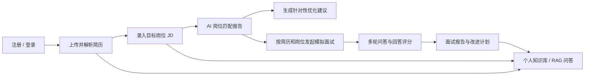
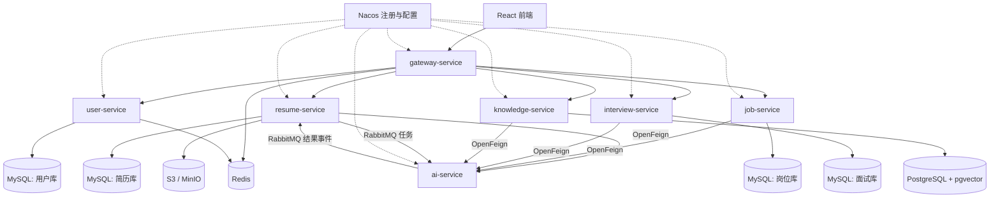

# CareerAI 改造分析与工作清单

> 基线项目：InterviewGuide（本地分析基于提交 `5afca6d`）
> 目标：将现有 AI 面试平台改造成面向大学生实习求职的 CareerAI 项目，并确保简历中的每一项技术描述都有可运行代码、测试或演示证据支撑。

## 1. 结论先行

现有项目已经具备较完整的简历解析、AI 简历分析、文字/语音模拟面试、RAG 知识库、SSE 流式回答、Redis Stream 异步任务和 Docker 部署能力，适合作为 CareerAI 的功能底座。

但它当前是一个 Spring Boot 单体应用，不是截图中描述的 Spring Cloud Alibaba 微服务系统；也没有完整的用户认证、岗位管理、岗位匹配、Gateway、Nacos、OpenFeign、RabbitMQ 和 MySQL。若直接使用截图中的简历描述，会存在明显的“简历描述超前于代码”问题。

推荐路线：

1. 先修复基线并完成“登录 → 简历 → 岗位 → 匹配 → 模拟面试 → 报告/RAG”业务闭环。
2. 再按稳定的业务边界拆为微服务，引入 Gateway、Nacos、OpenFeign 和 RabbitMQ。
3. 最后补齐测试、可观测性、部署、演示数据和项目文档，形成可答辩、可追问的简历项目。

不建议一开始就机械拆成 6～7 个空服务，否则会先承担分布式复杂度，却没有形成 CareerAI 与上游项目的业务差异。

## 2. 当前项目盘点

### 2.1 可直接复用或重点改造的能力

| 现有能力 | 当前实现 | 复用建议 |
| --- | --- | --- |
| 简历上传与解析 | Tika、S3 兼容对象存储、内容哈希去重、AI 分析、PDF 报告 | 高复用；增加用户隔离、岗位上下文和新的分析维度 |
| 异步任务 | Redis Stream，含任务状态、失败重试、ACK | 业务流程可复用；若简历要写 RabbitMQ，则替换为 RabbitMQ 并补齐可靠投递 |
| 文字模拟面试 | 会话、Skill 出题、多轮追问、回答评分、报告导出 | 高复用；改为由“用户 + 简历 + 目标岗位”共同驱动 |
| 语音模拟面试 | WebSocket、ASR/TTS、实时字幕、统一评估 | 可作为 P2 加分项，不应阻塞核心闭环 |
| RAG 知识库 | 文档上传、分块、pgvector、TopK/阈值检索、SSE | 高复用；增加用户级数据隔离、岗位和简历元数据过滤、引用来源 |
| AI 接入 | Spring AI ChatClient、多 Provider、结构化输出重试、Prompt 模板 | 高复用；沉淀 CareerAI 专属 Prompt 和模型调用审计 |
| 面试日程 | 邀请解析、日历与状态流转 | 可保留为 P2，不是首版核心 |
| 基础设施 | PostgreSQL、Redis、MinIO/RustFS、本地 Docker 容器 | 高复用；按目标架构增加 MySQL、RabbitMQ、Nacos |
| 前端 | React + TypeScript，多数业务页面已存在 | 复用组件和请求层，重做信息架构与 CareerAI 品牌 |

### 2.2 与目标简历描述的关键差距

| 截图中的目标描述 | 当前真实状态 | 必须完成的改造 |
| --- | --- | --- |
| Spring Cloud Alibaba 微服务 | 单体 Spring Boot + 单个 React 前端 | 建立多模块工程并完成真实服务拆分 |
| Nacos 注册发现与配置 | 不存在 | 注册服务、集中配置、环境隔离、健康检查 |
| Gateway 统一路由、跨域、JWT | 仅有应用内 CORS，无登录和 JWT | 新建网关、鉴权链路和下游身份传递机制 |
| OpenFeign 服务调用 | 不存在 | 定义服务契约、超时、错误转换和调用链测试 |
| user-service | 不存在完整用户模块 | 注册、登录、密码安全、令牌、用户资料、数据归属 |
| 岗位匹配分析 | 不存在岗位实体和匹配业务 | 新增岗位中心、JD 解析、匹配计算、结构化报告 |
| RabbitMQ 异步简历分析 | 当前使用 Redis Stream | 替换队列实现，增加 Confirm、手动 ACK、重试、死信和补偿 |
| MySQL | 当前仅 PostgreSQL + pgvector | MySQL 存核心业务，PostgreSQL 专门存向量数据，或从简历技术栈移除 MySQL |
| 用户数据隔离 | 大多数实体无 `userId`，语音模块存在默认用户逻辑 | 全链路补齐用户归属和越权访问测试 |
| AI 结果结构化落库 | 部分能力已有 | 扩展为简历亮点、岗位匹配、面试出题和评分统一模型 |

### 2.3 已验证的工程基线

- 后端约 177 个 Java 源文件、26 个测试文件、9 个 Controller、14 个 JPA Entity。
- 使用本机 JDK 21 执行 `mvn clean test`，后端测试通过。
- 前端 TypeScript 检查当前不通过，包含 type-only import、`NodeJS` 类型、`react-syntax-highlighter` 声明和不兼容编译选项等问题。
- 本地上游仓库工作区有未提交文件，且分支相对远端同时 ahead/behind；改造时不应直接在该工作区覆盖开发。
- 上游采用 AGPL-3.0。发布网络服务时要保留许可证、标明修改并向用户提供对应源码。

## 3. CareerAI 目标业务闭环

首版必须把这条链路走通。语音面试、日程和多模型管理可以保留，但暂时隐藏在“实验功能”或 P2 范围，避免冲淡求职业务主线。

## 4. 推荐目标架构

建议服务边界：

| 服务 | 负责内容 | 不负责内容 |
| --- | --- | --- |
| `gateway-service` | 路由、CORS、JWT 初检、限流、Trace ID | 业务查询和数据库访问 |
| `user-service` | 注册、登录、刷新/注销、个人资料、令牌状态 | 简历和面试数据 |
| `resume-service` | 文件、解析文本、简历状态、分析报告、异步任务编排 | 直接拼接大模型 Prompt |
| `job-service` | 岗位 CRUD、JD 解析、匹配任务与匹配报告 | 简历文件存储 |
| `interview-service` | 面试会话、题目、回答、评估报告 | 通用知识库管理 |
| `knowledge-service` | 文档、分块、向量化、召回、RAG 会话、SSE | 用户认证和岗位主数据 |
| `ai-service` | ChatClient、Prompt、结构化输出、模型路由、调用审计 | 持有其他服务的业务表 |

数据原则：每个服务拥有自己的表或 schema；跨服务只传 ID 和稳定 DTO，禁止跨库 Join。MySQL 是否必须引入应以简历目标为准：如果不准备真正维护两种数据库，就应继续使用 PostgreSQL，并从技术栈中删除 MySQL。

## 5. 分阶段工作清单

优先级说明：P0 为简历项目前必须完成；P1 为形成微服务亮点必须完成；P2 为时间充足时再做。

### 阶段 0：建立安全、可验证的改造基线（P0）

- [ ] 从上游仓库创建独立的 CareerAI 仓库或干净分支，保留上游提交历史和 LICENSE。
- [ ] 在 README 中注明“基于 InterviewGuide 二次开发”、修改日期、核心新增能力和上游地址。
- [ ] 检查 `.env`、历史提交和配置文件，确保没有真实 API Key、数据库密码或个人路径进入版本库。
- [ ] 统一项目名、包名、容器名、数据库名、对象存储 Bucket、前端标题和图标为 CareerAI。
- [x] 固化 JDK、Node、pnpm、Maven 版本，并生成一份环境启动说明。
- [ ] 修复前端 TypeScript 错误，确保前端 `pnpm build` 通过。
- [ ] 保持后端测试通过，并增加统一的 `check`/CI 命令。
- [ ] 连接本地 Docker 中间件，完成一次前后端基础冒烟测试。
- [ ] 决定 P0 暂时隐藏语音面试、面试日程和高级 Provider 设置，减少首版导航噪音。

验收：新开发者仅根据 README 能在 30 分钟内启动项目；后端测试和前端构建均为绿色；仓库不存在密钥。

### 阶段 1：产品模型、接口和数据库设计（P0）

- [ ] 明确首版角色只做“求职者”，暂不引入 HR/管理员复杂权限。
- [ ] 画出用户、简历、岗位、匹配报告、面试会话、知识库的 ER 图。
- [ ] 定义核心状态机：简历处理、匹配任务、面试会话、向量化任务。
- [ ] 定义 REST API 清单、统一错误码、分页格式和幂等请求头。
- [ ] 统一全局 ID 方案，避免服务拆分后数据库自增 ID 冲突。
- [ ] 定义跨服务事件：`ResumeUploaded`、`ResumeAnalysisRequested`、`ResumeAnalysisCompleted`、`MatchRequested`、`MatchCompleted`。
- [ ] 记录 4 份 ADR：为什么拆服务、为什么 RabbitMQ、为什么 MySQL + PostgreSQL、为什么先业务闭环后拆分。

验收：API、ER 图、状态机和服务边界评审后无循环依赖；每个数据字段都有明确归属服务。

### 阶段 2：用户认证与全链路数据隔离（P0）

- [ ] 新增用户注册、登录、获取当前用户、刷新令牌、注销接口。
- [ ] 密码使用 BCrypt/Argon2，不保存明文，不在日志输出密码和令牌。
- [ ] 设计短期 Access Token + 可撤销 Refresh Token，Redis 存储会话或令牌版本。
- [ ] Gateway 校验 JWT，并将可信用户上下文传给下游服务。
- [ ] 下游服务不可直接暴露公网端口；对身份头做来源保护或二次验签。
- [ ] 为简历、面试、知识库、聊天会话、面试日程补充 `userId`。
- [ ] 所有查询、更新、删除都同时校验资源 ID 和当前 `userId`。
- [ ] 清理语音模块中的默认用户逻辑，迁移旧数据到明确的测试用户。
- [ ] 增加越权测试：用户 A 无法查看、下载、删除或发起用户 B 的资源。
- [ ] 前端增加登录、注册、退出、令牌刷新和 401 统一处理。

验收：两个测试账号的数据完全隔离；伪造身份头、枚举资源 ID 和过期令牌都不能越权。

### 阶段 3：岗位中心与 AI 岗位匹配（P0，核心差异化）

- [ ] 新增岗位实体：公司、岗位名、JD 原文、技术要求、职责、学历、经验、来源和归属用户。
- [ ] 支持手动录入和粘贴 JD，后续再考虑网页抓取。
- [ ] 使用 Spring AI 将 JD 结构化为技能、职责、硬性条件和加分项。
- [ ] 用户选择一份简历和一个岗位发起匹配分析。
- [ ] 设计匹配维度：硬技能、项目经历、实习/工作经历、教育要求、关键词覆盖、风险项。
- [ ] 匹配结果必须包含总分、分项分数、命中证据、缺口、简历修改建议和面试准备建议。
- [ ] Prompt 要求证据必须来自简历/JD 原文，找不到证据时明确标记，降低模型编造。
- [ ] 结构化结果落库，并保存模型、Prompt 版本、耗时、Token 用量和失败原因。
- [ ] 同一简历/JD/Prompt 版本支持幂等或缓存，避免重复计费。
- [ ] 前端新增岗位列表、岗位详情、选择简历、匹配进度和匹配报告页。
- [ ] 准备至少 3 组固定简历/JD 样例，人工校验匹配结果是否可解释。

验收：从录入 JD 到得到可追溯匹配报告全链路可演示；报告中的每个关键判断能定位到输入证据。

### 阶段 4：RabbitMQ 简历分析可靠链路（P0/P1）

- [ ] 将简历状态明确为 `UPLOADED → PARSED → QUEUED → ANALYZING → COMPLETED/FAILED`。
- [ ] 上传后先完成文件校验、哈希去重、对象存储和原文持久化，再提交分析任务。
- [ ] 引入 RabbitMQ，定义业务 Exchange、Queue、Routing Key、重试队列和死信队列。
- [ ] 生产端启用 Publisher Confirm 和 Return；记录消息投递结果。
- [ ] 使用本地消息表/Outbox 保证“数据库状态更新”和“消息最终发送”一致。
- [ ] 消费端使用手动 ACK；只有业务结果持久化成功后才 ACK。
- [ ] 以 `taskId`/`resumeId + analysisVersion` 做幂等，重复消息不能产生重复报告。
- [ ] 对瞬时错误做有限次数延迟重试，对参数错误直接进入死信队列。
- [ ] 超过重试次数后将任务标记为 FAILED，并提供用户可见的重新分析入口。
- [ ] 增加定时补偿任务，扫描长时间停留在 QUEUED/ANALYZING 的异常任务。
- [ ] 增加任务状态查询或 SSE 推送，前端能实时显示进度。
- [ ] 删除原 Redis Stream 同类链路，避免两套消息机制同时维护同一状态。
- [ ] 测试消费者崩溃、重复投递、AI 超时、数据库失败和 ACK 失败场景。

验收：主动杀掉消费者或让 AI 调用失败后，任务能重试、恢复或明确进入死信/失败状态，不会永久“分析中”，也不会生成重复报告。

### 阶段 5：面向岗位的模拟面试（P0）

- [ ] 创建面试时必须选择目标岗位，可选关联简历和知识库。
- [ ] 将 JD 要求、简历亮点/薄弱点转成面试计划和题目分布。
- [ ] 区分自我介绍、基础知识、项目深挖、岗位场景和反问环节。
- [ ] 复用现有 Skill 出题和历史题目去重能力，但新增 CareerAI 专属 Skill/Prompt。
- [ ] 回答评分包含正确性、结构、深度、岗位相关性和表达质量。
- [ ] 对低分项生成追问，限制最大轮数并允许用户结束面试。
- [ ] 面试完成后异步生成总评、分项雷达图、薄弱知识点和下一步练习计划。
- [ ] 面试报告记录所用简历版本、岗位版本、Prompt 版本和模型。
- [ ] 所有面试资源接入用户隔离和权限测试。
- [ ] 优先完成文字面试；语音面试在文字链路稳定后再适配。

验收：同一份简历面对不同岗位能生成明显不同且可解释的面试重点；中断后可恢复，完成后可查看和导出报告。

### 阶段 6：RAG 知识库与业务融合（P1）

- [ ] 保留 PostgreSQL + pgvector 作为向量库，关系业务数据按目标方案迁至 MySQL。
- [ ] 文档分块元数据至少包含 `userId`、`knowledgeBaseId`、`documentId`、`sourceType`、`jobId`。
- [ ] 向量检索强制带用户和知识库过滤条件，禁止跨用户召回。
- [ ] 支持将岗位 JD、简历分析报告和面试薄弱点一键加入个人知识库。
- [ ] 保留查询改写、TopK 和相似度阈值，并为短/中/长查询配置不同策略。
- [ ] 回答展示引用片段、文档名和来源，低置信度时明确提示没有足够资料。
- [ ] 通过 SSE 流式返回回答，并处理客户端断开、模型超时和错误事件。
- [ ] 模拟面试出题可检索用户指定知识库，但要记录引用来源。
- [ ] 建立固定问答集，比较无 RAG、仅向量召回、重写 + 过滤后的效果。

验收：用户 A 的问题不可能召回用户 B 文档；答案有可点击来源；断开 SSE 不产生失控后台任务。

### 阶段 7：微服务工程化拆分（P1）

- [x] 建立 Maven 多模块父工程和统一依赖版本管理。
- [ ] 在实施前核对 Spring Boot、Spring Cloud、Spring Cloud Alibaba 与 Nacos 的官方兼容矩阵并锁定版本。
- [ ] 先抽取 `gateway-service`、`user-service`，再按业务边界逐个迁移，避免一次性大爆炸拆分。
- [ ] 接入 Nacos 服务注册与发现，并配置 dev/test/prod namespace/group。
- [ ] 将可动态调整且非敏感的配置放 Nacos；密钥使用环境变量或密钥管理服务。
- [ ] Gateway 配置路由、CORS、JWT、限流、Trace ID 和统一异常响应。
- [ ] 使用 OpenFeign 定义最小服务契约，设置连接/读取超时和受控重试。
- [ ] 禁止 Feign 返回 JPA Entity；契约 DTO 独立、可版本化。
- [ ] 禁止远程调用发生在长数据库事务中。
- [ ] 服务间调用失败时返回明确降级结果，不吞异常、不伪造成功。
- [ ] 每个服务有独立健康检查、OpenAPI、日志前缀和 Dockerfile。
- [ ] 文档化 Nacos、Gateway、各业务服务与本地 Docker 中间件的启动和检查方式。
- [ ] 仅 Gateway 暴露业务访问端口，其他服务放在内部网络。

验收：关闭任意一个下游服务后，Gateway 和其他服务仍能给出可诊断的错误；Nacos 能看到健康实例；跨服务调用链带同一 Trace ID。

### 阶段 8：前端产品化改造（P0/P1）

- [ ] 首页围绕“今日求职进度、最近简历、目标岗位、待练面试”重做，不沿用原项目模块堆叠式首页。
- [ ] 导航调整为：总览、我的简历、目标岗位、匹配分析、模拟面试、知识库。
- [ ] 增加登录/注册和个人中心。
- [ ] 统一异步任务状态组件，用于简历分析、岗位匹配、面试报告和向量化。
- [ ] 对上传、删除、重试、离开面试等危险操作增加明确确认和恢复提示。
- [ ] 统一空状态、错误状态、Skeleton 和移动端基本适配。
- [ ] 修复当前全部 TypeScript 错误，禁止新增 `any` 逃避类型问题。
- [ ] 为核心链路增加端到端测试：登录 → 上传 → 岗位 → 匹配 → 面试 → 报告。
- [ ] 替换原项目名称、Logo、截图和说明，形成独立视觉识别。

验收：新用户无需阅读文档即可完成核心业务链路；刷新、令牌过期、任务失败和网络中断都有清晰反馈。

### 阶段 9：数据库、配置与部署（P1）

- [ ] MySQL 和 PostgreSQL 都使用 Flyway/Liquibase 管理 schema，停止依赖生产环境 `ddl-auto=update`。
- [ ] 设计旧 PostgreSQL 业务数据迁移到 MySQL 的一次性脚本和校验报告。
- [ ] 创建最小权限数据库账号，不使用 root/postgres 超级用户运行应用。
- [ ] 为用户、状态、创建时间、任务幂等键和常用筛选条件建立索引。
- [ ] 对对象存储使用私有 Bucket 和限时签名 URL，不再使用公共读。
- [ ] 配置文件分环境，密钥不写入 Nacos 明文和 Git。
- [ ] 为 AI、MQ、数据库、SSE 和 Feign 设置超时、连接池与资源上限。
- [ ] 完成本地 Docker 中间件开发环境；若时间足够，再增加云服务器部署与 HTTPS。
- [ ] 增加数据库和对象存储备份/恢复说明。

验收：全新环境一条命令可启动；数据库迁移可重复执行；容器重启不丢数据；公共网络无法直接访问内部服务和数据库。

### 阶段 10：测试、可观测性和故障演练（P1）

- [ ] 单元测试覆盖核心状态机、权限、匹配结果解析和消息幂等。
- [ ] 使用 Testcontainers 做 MySQL、PostgreSQL/pgvector、Redis、RabbitMQ 集成测试。
- [ ] 增加 Gateway + JWT、Feign 和 SSE 的集成测试。
- [ ] 增加 Prompt 结构化输出契约测试和固定样例回归测试。
- [ ] 增加 Micrometer 指标：AI 调用耗时/失败率、MQ 堆积、任务成功率、SSE 活跃数、Feign 失败率。
- [ ] 统一结构化日志，包含 Trace ID、userId、taskId、service、model，敏感字段脱敏。
- [ ] 建立 5 个故障演练：模型超时、RabbitMQ 暂停、消费者崩溃、数据库短暂不可用、对象存储失败。
- [ ] CI 执行后端测试、前端 lint/build、镜像构建和依赖安全检查。

验收：关键失败能从指标和日志快速定位；核心链路具有自动化回归，不依赖手工“点一遍”。

### 阶段 11：简历、答辩与交付材料（P0/P1）

- [ ] README 写清产品定位、本人改造内容、系统架构、业务流程、启动方式和演示账号。
- [ ] 补充架构图、ER 图、MQ 时序图、RAG 流程图和关键页面截图。
- [ ] 准备脱敏的演示简历、3 个岗位 JD、知识库文档和完整面试记录。
- [ ] 准备 5 分钟演示脚本，严格走核心业务闭环。
- [ ] 准备技术追问题：服务拆分依据、消息一致性、幂等、JWT 安全、RAG 过滤、模型幻觉、数据库选型。
- [ ] 准备故障案例：一次真实问题、定位过程、修复方案和验证结果。
- [ ] 建立“简历描述 → 代码位置 → 测试/演示证据”对照表。
- [ ] 项目日期按真实开发时间填写，不倒填尚未完成的时间和能力。
- [ ] 明确上游项目和本人新增/重构范围，不将上游现成功能全部表述为个人原创。

验收：简历每一个动词都能对应具体代码和可复现证据；能独立解释关键取舍和失败场景。

## 6. 建议排期

以下按一人持续开发估算；如果只能课余开发，应预留更多时间。

| 周期 | 主要目标 | 里程碑 |
| --- | --- | --- |
| 第 1 周 | 基线修复、品牌改造、ER/API、用户体系 | 两个用户可登录且数据隔离 |
| 第 2 周 | 岗位中心、JD 解析、岗位匹配 | 首个 CareerAI 差异化闭环完成 |
| 第 3 周 | RabbitMQ 简历分析可靠链路 | 重试、死信、幂等和补偿演示通过 |
| 第 4 周 | 岗位化文字面试、报告、RAG 融合 | 登录到面试报告端到端可用 |
| 第 5～6 周 | Gateway、Nacos、OpenFeign、服务拆分 | 微服务版可通过 Compose 启动 |
| 第 7 周 | 前端产品化、测试、可观测性 | CI 绿色，故障演练完成 |
| 第 8 周 | 部署、演示数据、README、答辩材料 | 可公开展示并写入简历 |

若时间只有 4 周：完成阶段 0～5 和前端核心链路，先保留模块化单体；不要在微服务只做出空壳时就写进简历。

## 7. 简历描述的完成门槛

| 想写进简历的表述 | 最低证据门槛 |
| --- | --- |
| “基于 Spring Cloud Alibaba 拆分服务” | 至少 4 个有真实数据和调用关系的服务，Nacos 可见，服务可独立启动 |
| “Gateway 统一鉴权” | 登录、过期、刷新、越权和绕过网关测试均通过 |
| “OpenFeign 完成服务间调用” | 有真实业务调用、超时配置、错误处理和集成测试 |
| “RabbitMQ 可靠异步链路” | Confirm、手动 ACK、重试、死信、幂等和补偿均可演示 |
| “Spring AI 结构化分析” | Prompt 版本化、结构化落库、解析失败重试、样例回归 |
| “pgvector RAG” | 文档分块、向量化、元数据过滤、TopK/阈值、引用来源、SSE |
| “提升准确性/性能” | 有固定数据集和前后对比；没有数据时不要写百分比 |

## 8. 建议暂缓或删除的内容

- 暂缓 WebRTC、更多 TTS 音色和复杂语音优化，除非目标岗位强调音视频。
- 暂缓 HR/企业端、多租户组织、支付、社交、爬虫招聘站点等旁支业务。
- 不要同时保留 Redis Stream 和 RabbitMQ 承担同一类简历任务。
- 不要为了技术栈同时使用 MySQL 与 PostgreSQL；只有明确的数据职责拆分时才保留两者。
- 不要先抽取大量 `common` 模块；只共享稳定的错误格式、认证上下文和基础 DTO。
- 不要编造“准确率提升 30%”“首包 200ms”等数字，除非已有可复现测试报告。

## 9. 第一批可直接执行的任务

- [ ] 创建 CareerAI 独立 Git 仓库并保留 AGPL 与上游说明。
- [ ] 将上游代码干净地导入 CareerAI，排除 `.env`、IDE 和构建产物。
- [ ] 修复前端 TypeScript 构建，建立后端测试 + 前端构建基线。
- [ ] 输出 ER 图和 API v1 草案。
- [ ] 实现用户注册登录和所有资源的 `userId` 迁移。
- [ ] 实现岗位 CRUD、JD 结构化和第一个岗位匹配报告。
- [ ] 完成“登录 → 上传简历 → 新建岗位 → 查看匹配报告”的前端链路。
- [ ] 再开始 RabbitMQ 替换和微服务拆分。

完成上述 8 项后，项目才真正从 InterviewGuide 的换皮版本进入 CareerAI 的独立改造阶段。
